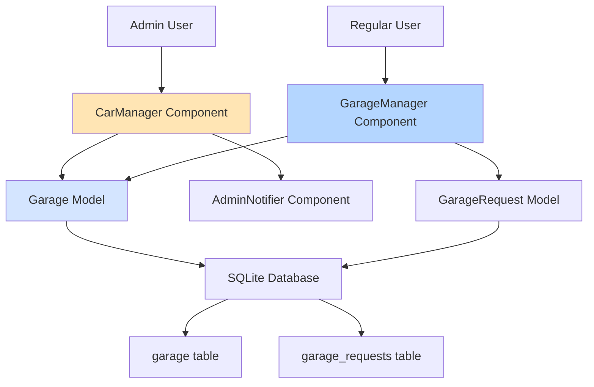
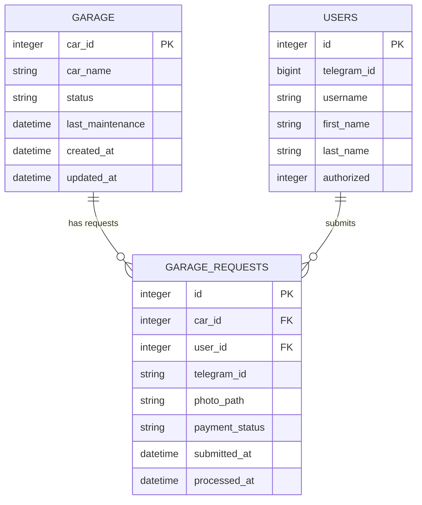
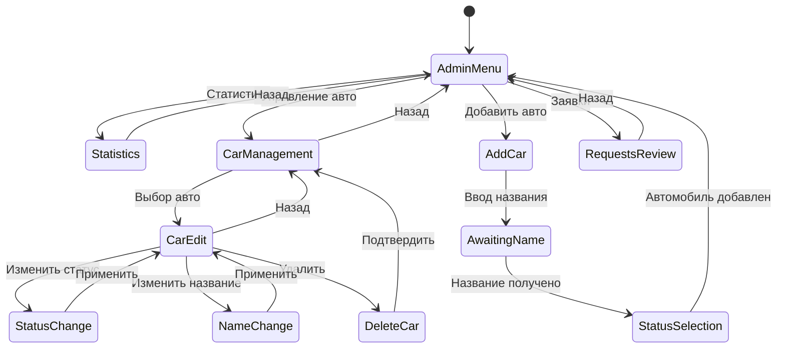
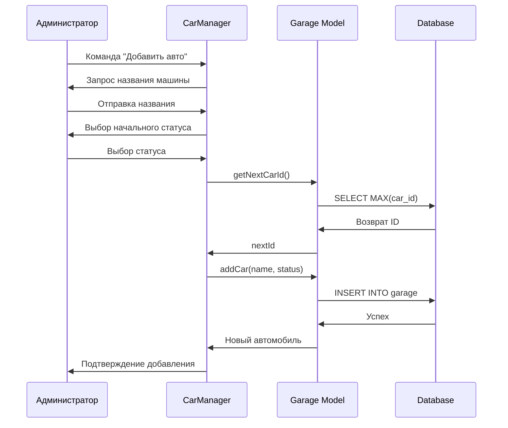
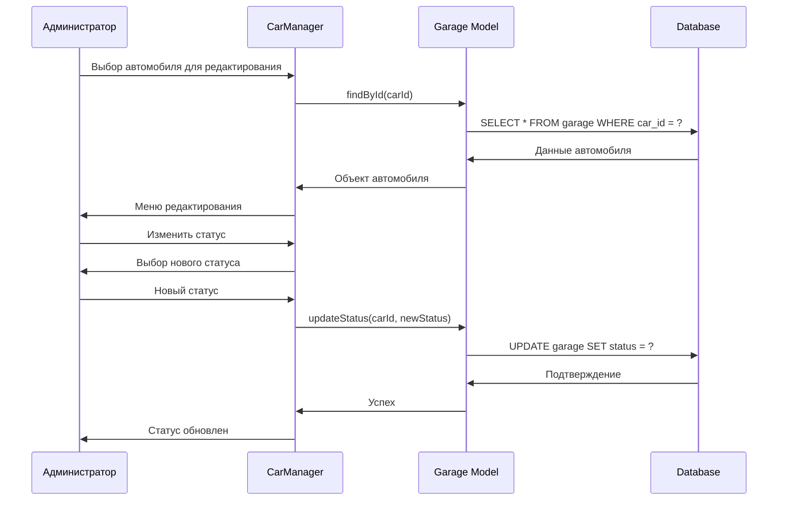

# Система Администрирования Гаража - Дизайн Документ

## Обзор

Данная система предназначена для расширения существующей системы управления гаражом в Telegram боте с фокусом на административные функции. Система позволяет администраторам удобно управлять автомобилями и их состоянием через интуитивное меню.

### Текущее Состояние Системы

Система уже включает в себя:
- Команду `/takecar` для пользователей
- 20 предустановленных автомобилей с различными статусами
- Систему заявок на обслуживание автомобилей
- Базовые административные функции

### Цель Проекта

Создать удобную административную панель для управления автомобилями в гараже, включая добавление новых машин и изменение их состояния.

## Архитектура

### Компонентная Диаграмма



### Архитектура Данных



## Административные Функции

### Команда /garage_admin

Новая команда для администраторов с расширенным функционалом:

```mermaid
flowchart TD
    A[/garage_admin] --> B{Проверка прав администратора}
    B -->|Да| C[Главное меню гаража]
    B -->|Нет| D[Отказ в доступе]
    
    C --> E[📊 Статистика]
    C --> F[🔧 Управление автомобилями]
    C --> G[➕ Добавить автомобиль]
    C --> H[📋 Заявки на обслуживание]
    
    F --> I[Список всех автомобилей]
    I --> J[Изменить статус]
    I --> K[Изменить название]
    I --> L[Удалить автомобиль]
    
    G --> M[Ввод названия машины]
    M --> N[Выбор начального статуса]
    N --> O[Подтверждение добавления]
    
    style C fill:#E8F5E8
    style F fill:#FFE5B4
    style G fill:#E5F5FF
```

### Интерфейс Администратора

#### Главное меню

```
🔧 АДМИН ПАНЕЛЬ ГАРАЖА

📊 Статистика: 20 машин
🟢 Хорошее: 8 автомобилей
🟡 Среднее: 7 автомобилей  
🔴 Плохое: 5 автомобилей

[📊 Статистика] [🔧 Управление авто]
[➕ Добавить авто] [📋 Заявки (3)]
[🏠 Главное меню]
```

#### Управление Автомобилями

```
🔧 УПРАВЛЕНИЕ АВТОМОБИЛЯМИ (Страница 1/4)

1. 🟢 Infernus: Хорошее
2. 🟡 Cheetah: Среднее
3. 🔴 Banshee: Плохое
4. 🟢 Bullet: Хорошее
5. 🟡 Turismo: Среднее

[✏️ Изменить] [✏️ Изменить]
[✏️ Изменить] [✏️ Изменить]
[✏️ Изменить]

[⬅️ Назад] [➡️ Далее]
[➕ Добавить авто] [🏠 Главное меню]
```

## Модели Данных

### Существующая Модель Garage

Класс уже содержит необходимые методы:

| Метод | Описание | Использование |
|-------|----------|---------------|
| `getAllCars()` | Получить все автомобили | Список для администратора |
| `updateStatus(carId, status)` | Обновить статус | Изменение состояния |
| `getStatistics()` | Статистика по статусам | Административная панель |
| `getCarsPaginated(page, size)` | Пагинация | Удобная навигация |

### Новые Методы для CarManager

```javascript
// Добавление нового автомобиля
static async addCar(carName, status = 'Хорошее')

// Удаление автомобиля
static async deleteCar(carId)

// Массовое обновление статусов
static async bulkUpdateStatus(updates)

// Получить следующий доступный ID
static async getNextCarId()
```

## Состояния Интерфейса

### Диаграмма Состояний Администратора



## Логика Управления Автомобилями

### Процесс Добавления Автомобиля



### Процесс Изменения Статуса



## Компонент CarManager

### Структура Класса

```javascript
class CarManager {
    constructor(bot, adminId)
    
    // Основные команды
    async handleGarageAdminCommand(msg)
    async showAdminMenu(chatId)
    
    // Управление автомобилями
    async showCarManagement(chatId, page = 0)
    async handleCarEdit(callbackQuery)
    async handleStatusChange(callbackQuery)
    async handleNameChange(callbackQuery)
    async handleDeleteCar(callbackQuery)
    
    // Добавление автомобилей
    async handleAddCar(callbackQuery)
    async processNewCarName(msg)
    async processCarStatus(callbackQuery)
    
    // Статистика и заявки
    async showStatistics(chatId)
    async showRequests(chatId)
    
    // Вспомогательные методы
    buildAdminKeyboard()
    buildCarManagementKeyboard(cars, pagination)
    buildStatusKeyboard(carId)
    setAdminSession(telegramId, sessionData)
    getAdminSession(telegramId)
}
```

### Состояния Сессий

```javascript
ADMIN_STATES = {
    AWAITING_CAR_NAME: 'admin_awaiting_car_name',
    AWAITING_NEW_CAR_NAME: 'admin_awaiting_new_car_name',
    CONFIRMING_DELETE: 'admin_confirming_delete'
}
```

## Клавиатуры и Интерфейс

### Главная Административная Клавиатура

```javascript
[
    [
        { text: '📊 Статистика', callback_data: 'admin_stats' },
        { text: '🔧 Управление', callback_data: 'admin_manage' }
    ],
    [
        { text: '➕ Добавить авто', callback_data: 'admin_add_car' },
        { text: '📋 Заявки', callback_data: 'admin_requests' }
    ],
    [
        { text: '🏠 Главное меню', callback_data: 'back_to_main' }
    ]
]
```

### Клавиатура Управления Автомобилем

```javascript
[
    [
        { text: '🎨 Изменить статус', callback_data: `admin_status_${carId}` },
        { text: '✏️ Изменить название', callback_data: `admin_name_${carId}` }
    ],
    [
        { text: '🗑️ Удалить авто', callback_data: `admin_delete_${carId}` }
    ],
    [
        { text: '⬅️ Назад к списку', callback_data: 'admin_manage' }
    ]
]
```

### Клавиатура Выбора Статуса

```javascript
[
    [
        { text: '🟢 Хорошее', callback_data: `admin_set_status_${carId}_Хорошее` }
    ],
    [
        { text: '🟡 Среднее', callback_data: `admin_set_status_${carId}_Среднее` }
    ],
    [
        { text: '🔴 Плохое', callback_data: `admin_set_status_${carId}_Плохое` }
    ],
    [
        { text: '❌ Отмена', callback_data: `admin_edit_${carId}` }
    ]
]
```

## Интеграция с Существующей Системой

### Изменения в app.js

```javascript
// Добавление нового компонента
const CarManager = require('./components/CarManager');

// Инициализация
const carManager = new CarManager(bot, process.env.ADMIN_ID);

// Обработчики команд
bot.onText(/\/garage_admin/, (msg) => {
    carManager.handleGarageAdminCommand(msg);
});

// Callback query для административных функций
bot.on('callback_query', (callbackQuery) => {
    if (callbackQuery.data.startsWith('admin_')) {
        carManager.handleAdminCallback(callbackQuery);
    }
});
```

### Расширение Модели Garage

```javascript
// Добавление метода для создания нового автомобиля
static async addCar(carName, status = 'Хорошее') {
    const nextId = await this.getNextCarId();
    const sql = `
        INSERT INTO garage (car_id, car_name, status, last_maintenance) 
        VALUES (?, ?, ?, CURRENT_TIMESTAMP)
    `;
    
    try {
        await database.run(sql, [nextId, carName, status]);
        return await this.findById(nextId);
    } catch (error) {
        throw new Error(`Ошибка добавления автомобиля: ${error.message}`);
    }
}

// Получение следующего доступного ID
static async getNextCarId() {
    const sql = 'SELECT MAX(car_id) as maxId FROM garage';
    try {
        const result = await database.get(sql);
        return (result.maxId || 0) + 1;
    } catch (error) {
        throw new Error(`Ошибка получения следующего ID: ${error.message}`);
    }
}

// Удаление автомобиля
static async deleteCar(carId) {
    const sql = 'DELETE FROM garage WHERE car_id = ?';
    try {
        const result = await database.run(sql, [carId]);
        if (result.changes === 0) {
            throw new Error(`Автомобиль с ID ${carId} не найден`);
        }
        return true;
    } catch (error) {
        throw new Error(`Ошибка удаления автомобиля: ${error.message}`);
    }
}
```

## Безопасность и Валидация

### Проверка Прав Администратора

```javascript
async isAdmin(telegramId) {
    const adminIds = process.env.ADMIN_IDS.split(',').map(id => parseInt(id));
    return adminIds.includes(telegramId);
}
```

### Валидация Данных

```javascript
validateCarName(name) {
    if (!name || name.trim().length === 0) {
        throw new Error('Название автомобиля не может быть пустым');
    }
    
    if (name.length > 50) {
        throw new Error('Название автомобиля слишком длинное (максимум 50 символов)');
    }
    
    return name.trim();
}

validateStatus(status) {
    const validStatuses = ['Хорошее', 'Среднее', 'Плохое'];
    if (!validStatuses.includes(status)) {
        throw new Error(`Недопустимый статус: ${status}`);
    }
    return status;
}
```

## Локализация

### Сообщения Администратора

```javascript
ADMIN_MESSAGES = {
    ACCESS_DENIED: '❌ Доступ запрещен! Эта команда доступна только администраторам.',
    MAIN_MENU: '🔧 АДМИН ПАНЕЛЬ ГАРАЖА',
    CAR_ADDED: '✅ Автомобиль "{name}" успешно добавлен!',
    CAR_DELETED: '🗑️ Автомобиль "{name}" успешно удален!',
    STATUS_UPDATED: '✅ Статус автомобиля "{name}" изменен на {status}',
    NAME_UPDATED: '✅ Название автомобиля изменено на "{name}"',
    ENTER_CAR_NAME: '📝 Введите название нового автомобиля:',
    SELECT_STATUS: '🎨 Выберите начальный статус автомобиля:',
    CONFIRM_DELETE: '⚠️ Вы уверены, что хотите удалить автомобиль "{name}"?'
};
```