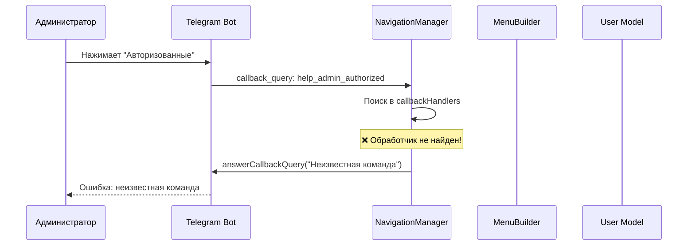
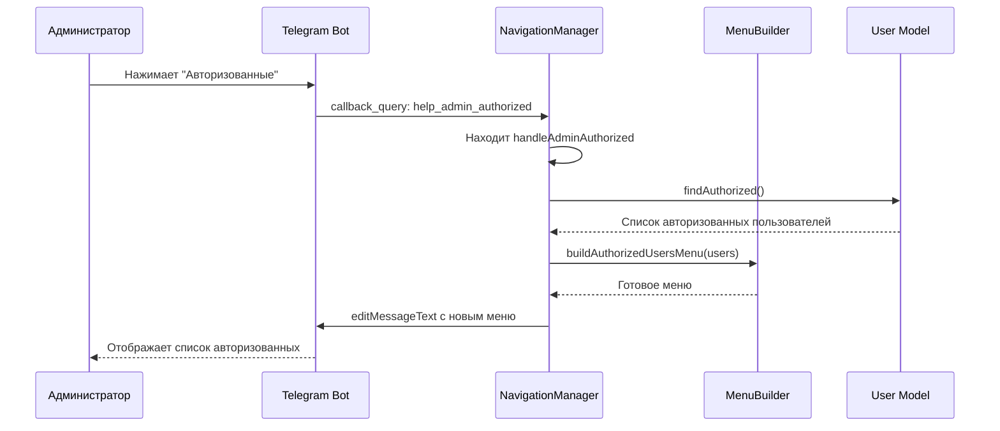
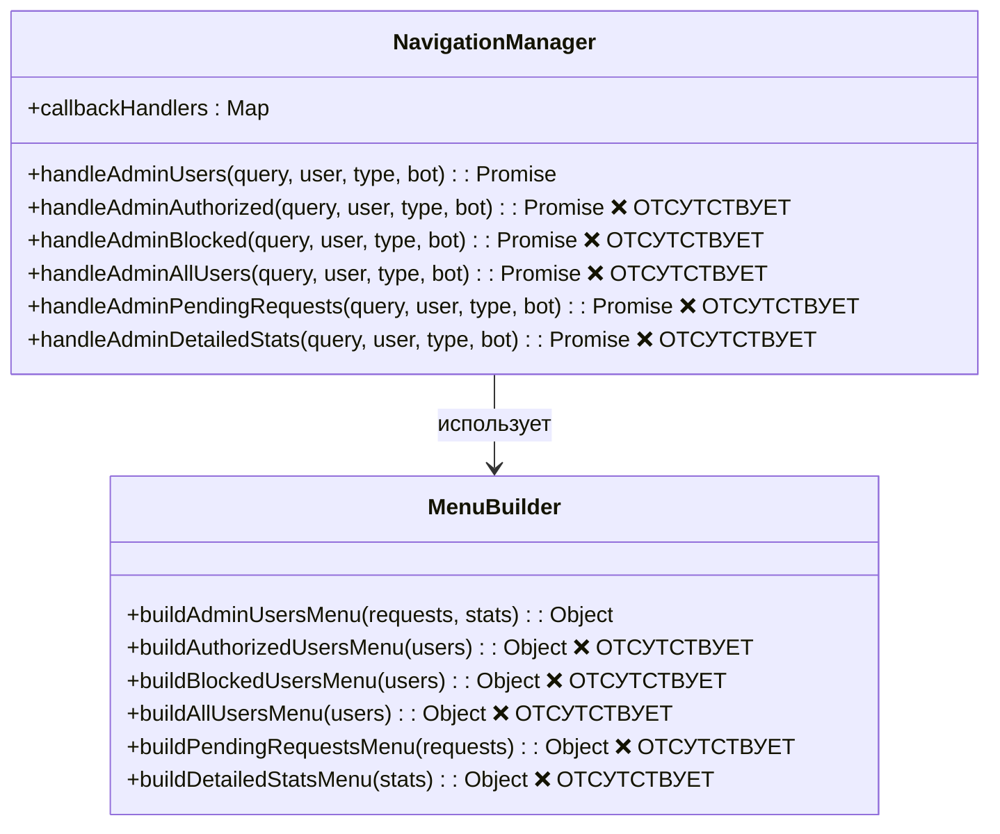
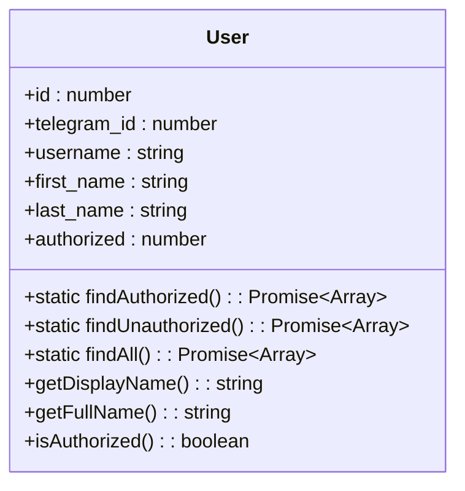
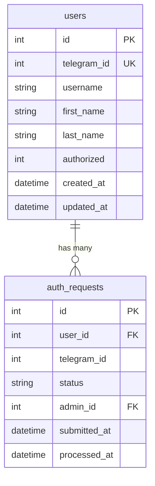

# Исправление кнопки "Авторизованные" в админ-меню

## Обзор

Текущая проблема: в команде `/help` в админ-меню кнопка "Авторизованные" не работает из-за отсутствующего обработчика callback-запроса в компоненте NavigationManager.

## Архитектура

### Текущее состояние системы



### Желаемое состояние



## Компонентная архитектура

### NavigationManager - недостающие обработчики



### Модель данных User



## Детальные исправления

### 1. Обновление NavigationManager

#### Добавление недостающих обработчиков в карту callbackHandlers

```javascript
this.callbackHandlers = {
    // ... существующие обработчики
    
    // Новые обработчики админских функций
    'help_admin_authorized': this.handleAdminAuthorized.bind(this),
    'help_admin_blocked': this.handleAdminBlocked.bind(this),
    'help_admin_all_users': this.handleAdminAllUsers.bind(this),
    'help_admin_pending_requests': this.handleAdminPendingRequests.bind(this),
    'help_admin_detailed_stats': this.handleAdminDetailedStats.bind(this)
};
```

#### Реализация обработчика handleAdminAuthorized

```javascript
async handleAdminAuthorized(callbackQuery, user, userType, bot) {
    const chatId = callbackQuery.message.chat.id;
    const messageId = callbackQuery.message.message_id;
    
    // Получаем список авторизованных пользователей
    const User = require('../database/models/user');
    const authorizedUsers = await User.findAuthorized();
    
    const menuData = this.menuBuilder.buildAuthorizedUsersMenu(authorizedUsers);
    
    await bot.editMessageText(menuData.text, {
        chat_id: chatId,
        message_id: messageId,
        reply_markup: menuData.keyboard,
        parse_mode: 'HTML'
    });
    
    return { notificationText: `Найдено ${authorizedUsers.length} авторизованных пользователей` };
}
```

### 2. Обновление MenuBuilder

#### Метод buildAuthorizedUsersMenu

```javascript
buildAuthorizedUsersMenu(authorizedUsers = []) {
    const userList = authorizedUsers.length > 0 
        ? authorizedUsers.slice(0, 10).map((user, index) => 
            `${index + 1}. ${user.getDisplayName()} (ID: ${user.telegram_id})`
          ).join('\n')
        : 'Нет авторизованных пользователей';
    
    const moreUsersText = authorizedUsers.length > 10 
        ? `\n\n... и еще ${authorizedUsers.length - 10} пользователей`
        : '';
    
    const text = `${this.emojis.authorized} АВТОРИЗОВАННЫЕ ПОЛЬЗОВАТЕЛИ

📊 Всего авторизованных: ${authorizedUsers.length}

👥 Список пользователей:
${userList}${moreUsersText}

🔧 Действия:
• Просмотр полного списка
• Отзыв авторизации
• Массовые операции`;

    const keyboard = {
        inline_keyboard: [
            [
                { text: '📋 Полный список', callback_data: 'help_admin_full_authorized_list' },
                { text: '🔍 Поиск пользователя', callback_data: 'help_admin_search_user' }
            ],
            [
                { text: '📤 Экспорт списка', callback_data: 'help_admin_export_authorized' },
                { text: '📊 Статистика', callback_data: 'help_admin_authorized_stats' }
            ],
            [
                { text: `${this.emojis.back} Назад к управлению`, callback_data: 'help_admin_users' }
            ]
        ]
    };

    return { text, keyboard };
}
```

## Данные и состояние

### Структура callback_data

| Callback Data | Описание | Обработчик |
|---|---|---|
| `help_admin_authorized` | Список авторизованных | `handleAdminAuthorized` |
| `help_admin_blocked` | Список заблокированных | `handleAdminBlocked` |
| `help_admin_all_users` | Все пользователи | `handleAdminAllUsers` |
| `help_admin_pending_requests` | Ожидающие заявки | `handleAdminPendingRequests` |
| `help_admin_detailed_stats` | Детальная статистика | `handleAdminDetailedStats` |

### Взаимодействие с базой данных



## Тестирование

### Юнит-тесты для NavigationManager

```javascript
describe('NavigationManager - Admin Users Management', () => {
    test('handleAdminAuthorized должен возвращать список авторизованных', async () => {
        const mockUsers = [
            { telegram_id: 123, getDisplayName: () => 'User1' },
            { telegram_id: 456, getDisplayName: () => 'User2' }
        ];
        
        User.findAuthorized.mockResolvedValue(mockUsers);
        
        const result = await navigationManager.handleAdminAuthorized(
            mockCallbackQuery, mockUser, 'admin', mockBot
        );
        
        expect(result.notificationText).toContain('2 авторизованных');
        expect(mockBot.editMessageText).toHaveBeenCalled();
    });
});
```

### Интеграционные тесты

```javascript
describe('Admin Users Menu Integration', () => {
    test('Кнопка "Авторизованные" должна работать для админа', async () => {
        const callbackQuery = {
            data: 'help_admin_authorized',
            from: { id: ADMIN_ID },
            message: { chat: { id: CHAT_ID }, message_id: MSG_ID }
        };
        
        const result = await navigationManager.handleCallback(
            callbackQuery, adminUser, bot
        );
        
        expect(result).toBe(true);
        expect(bot.answerCallbackQuery).toHaveBeenCalledWith(
            callbackQuery.id, 
            expect.objectContaining({ text: expect.stringContaining('авторизованных') })
        );
    });
});
```

## Безопасность

### Контроль доступа

```javascript
// В методе checkAccess
if (callbackData.startsWith('help_admin_') && userType !== 'admin') {
    return {
        allowed: false,
        message: '👑 Доступно только администраторам'
    };
}
```

### Валидация данных

- Проверка существования пользователей перед отображением
- Ограничение количества пользователей в списке (пагинация)
- Защита от SQL-инъекций через параметризованные запросы в User модели

## Логирование и мониторинг

### События для логирования

```javascript
// В handleAdminAuthorized
console.log(`Admin ${user.telegram_id} viewed authorized users list`);

// Метрики
const HelpMetrics = require('../database/models/helpMetrics');
await HelpMetrics.recordUsage(user.telegram_id, 'help_admin_authorized');
```

### Мониторинг производительности

- Отслеживание времени выполнения запросов к БД
- Мониторинг использования админских функций
- Алерты при ошибках в обработчиках