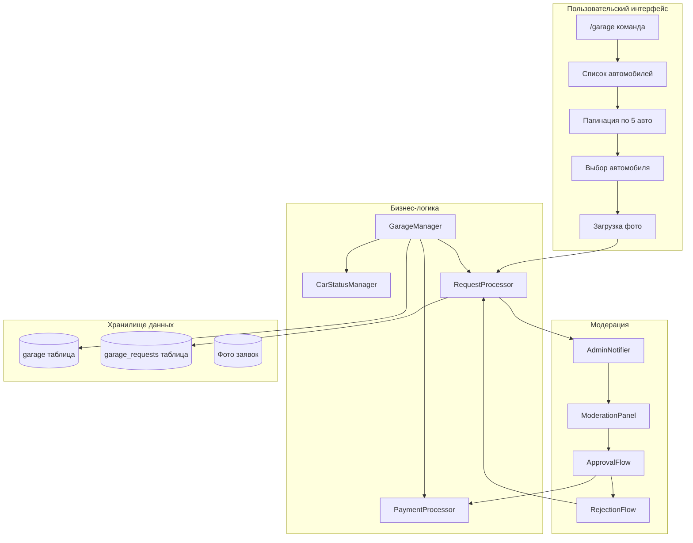
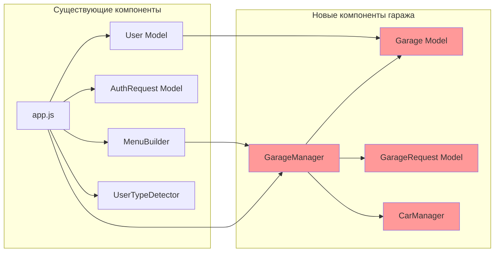
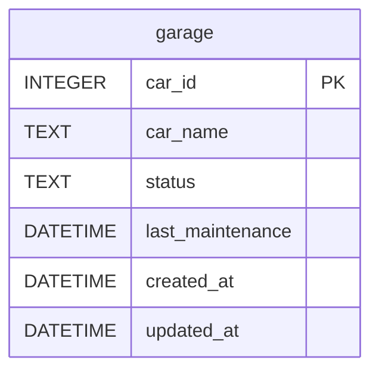
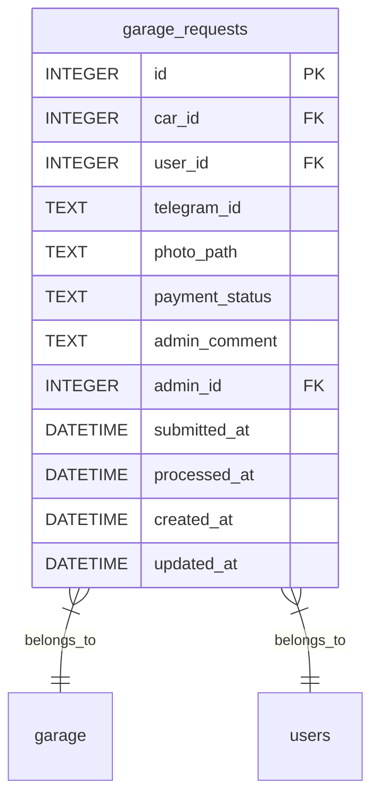
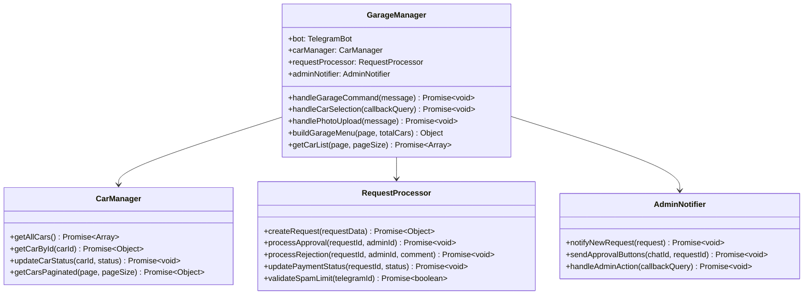
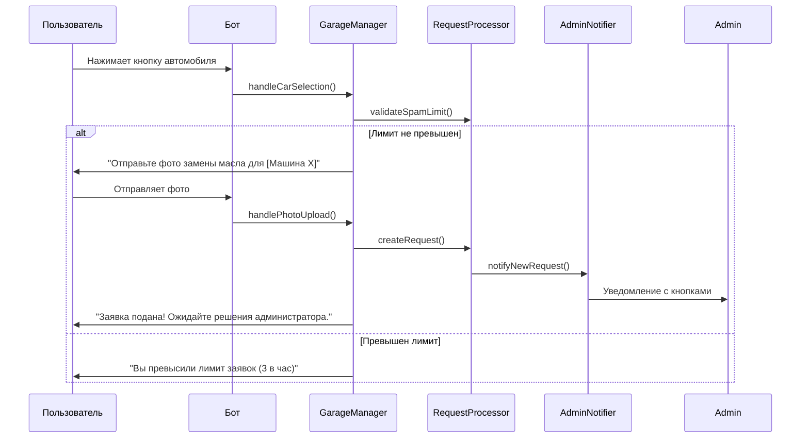
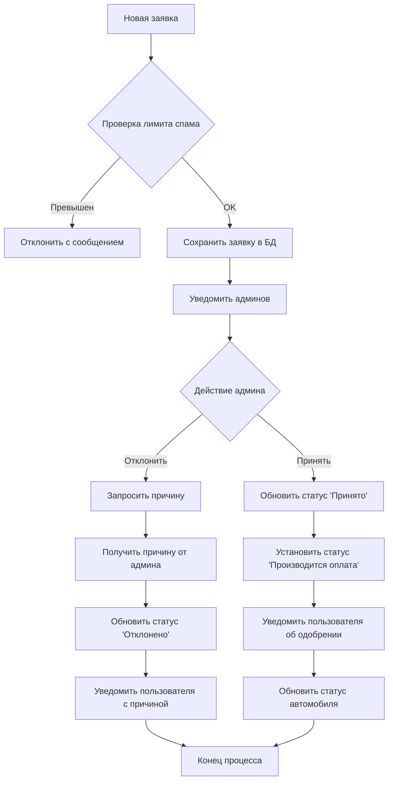
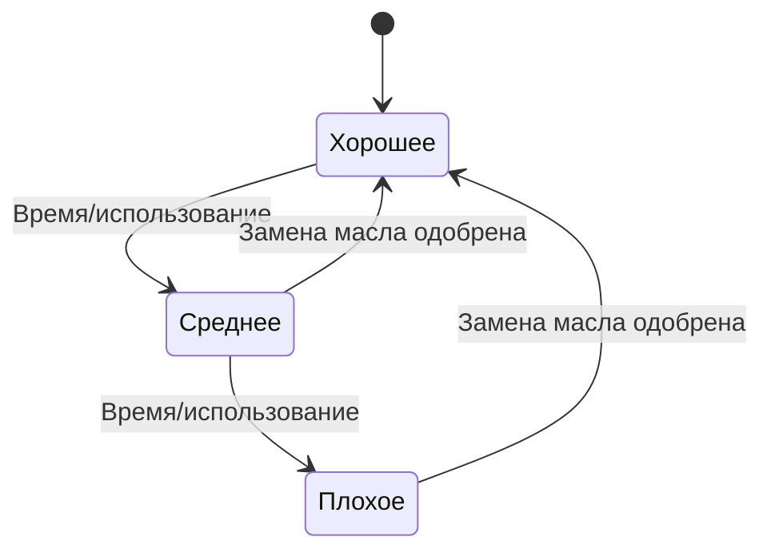

# Дизайн системы управления гаражом для Telegram бота

## Обзор

Система управления гаражом представляет собой модуль для существующего Telegram бота, который автоматизирует процесс управления заменой масла в автомобилях семьи через систему заявок с модерацией и вознаграждениями.

### Основные цели
- Автоматизация учета состояния автомобилей в гараже
- Система подачи заявок на замену масла через фотографии
- Модерация заявок администраторами
- Автоматические выплаты вознаграждений (3 млн игровой валюты)
- Интеграция с существующей системой авторизации

## Архитектура системы

### Общая архитектура модуля



### Интеграция с существующей системой

Модуль гаража интегрируется с существующей архитектурой проекта tgai:



## Модели данных

### Таблица garage (основные автомобили)



**Поля:**
- `car_id` (INTEGER, PRIMARY KEY): Уникальный ID автомобиля (1-20)
- `car_name` (TEXT, NOT NULL): Название автомобиля (например, "Infernus")
- `status` (TEXT, NOT NULL): Состояние масла ("Среднее", "Хорошее", "Плохое")
- `last_maintenance` (DATETIME): Дата последнего обслуживания
- `created_at` (DATETIME): Дата создания записи
- `updated_at` (DATETIME): Дата последнего обновления

### Таблица garage_requests (заявки на обслуживание)



**Поля:**
- `id` (INTEGER, PRIMARY KEY): Уникальный ID заявки
- `car_id` (INTEGER, FOREIGN KEY): Ссылка на автомобиль
- `user_id` (INTEGER, FOREIGN KEY): Ссылка на пользователя из таблицы users
- `telegram_id` (TEXT): Telegram ID пользователя (для быстрого поиска)
- `photo_path` (TEXT): Путь к загруженному фото
- `payment_status` (TEXT): Статус оплаты ("Не выплачено", "Принято", "Отклонено", "Производится оплата")
- `admin_comment` (TEXT): Комментарий администратора при отклонении
- `admin_id` (INTEGER, FOREIGN KEY): ID администратора, обработавшего заявку
- `submitted_at` (DATETIME): Время подачи заявки
- `processed_at` (DATETIME): Время обработки заявки
- `created_at` (DATETIME): Дата создания записи
- `updated_at` (DATETIME): Дата последнего обновления

## Компоненты системы

### GarageManager (основной контроллер)



### Модели данных

```mermaid
classDiagram
    class Garage {
        +number car_id
        +string car_name
        +string status
        +Date last_maintenance
        +Date created_at
        +Date updated_at
        +static getAllCars() Promise~Array~
        +static findById(carId) Promise~Garage~
        +static updateStatus(carId, status) Promise~void~
        +static initializeDefaultCars() Promise~void~
        +isMaintenanceNeeded() boolean
        +getStatusEmoji() string
    }
    
    class GarageRequest {
        +number id
        +number car_id
        +number user_id
        +string telegram_id
        +string photo_path
        +string payment_status
        +string admin_comment
        +number admin_id
        +Date submitted_at
        +Date processed_at
        +static create(requestData) Promise~GarageRequest~
        +static findById(id) Promise~GarageRequest~
        +static findPendingRequests() Promise~Array~
        +static findByUserAndCar(userId, carId) Promise~GarageRequest~
        +static countRecentByUser(telegramId, hours) Promise~number~
        +approve(adminId) Promise~void~
        +reject(adminId, comment) Promise~void~
        +getFormattedStatus() string
        +getCar() Promise~Garage~
        +getUser() Promise~User~
    }
    
    Garage ||--o{ GarageRequest : "has requests"
```

## Пользовательские интерфейсы

### Команда /garage

Отображает список автомобилей с пагинацией:

```
🚗 ГАРАЖ СЕМЬИ | АВТОМОБИЛИ (1/3)

🟢 Infernus: Хорошее
🟡 Cheetah: Среднее  
🔴 Banshee: Плохое
🟢 Bullet: Хорошее
🟡 Turismo: Среднее

[🚗 Infernus] [🚗 Cheetah]
[🚗 Banshee] [🚗 Bullet]
[🚗 Turismo] [➡️ Далее]
```

### Обработка выбора автомобиля



### Панель модерации для администраторов

```
🚨 НОВАЯ ЗАЯВКА #12345

👤 Пользователь: Иван Петров (@ivan_petrov)
🚗 Автомобиль: Infernus  
📷 Фото: [Фотография]
⏰ Подано: 15:30, 25.12.2023

[✅ Принять] [❌ Отклонить]
```

## Алгоритмы и бизнес-логика

### Алгоритм обработки заявки



### Анти-спам система

```javascript
// Псевдокод для проверки лимита заявок
async function validateSpamLimit(telegramId) {
    const HOUR_LIMIT = 3;
    const recentCount = await GarageRequest.countRecentByUser(telegramId, 1); // 1 час
    return recentCount < HOUR_LIMIT;
}
```

### Система состояний автомобилей



## API команд и обработчиков

### Команды бота

| Команда | Описание | Доступ |
|---------|----------|--------|
| `/garage` | Показать список автомобилей | Авторизованные пользователи |

### Callback Query обработчики

| Паттерн | Описание | Обработчик |
|---------|----------|------------|
| `select_car_{carId}` | Выбор автомобиля | `handleCarSelection()` |
| `garage_page_{page}` | Пагинация списка | `handlePageNavigation()` |
| `garage_approve_{requestId}` | Одобрение заявки | `handleAdminApproval()` |
| `garage_reject_{requestId}` | Отклонение заявки | `handleAdminRejection()` |

### Состояния разговора

```javascript
const GARAGE_STATES = {
    AWAITING_PHOTO: 'garage_awaiting_photo',
    AWAITING_REJECTION_REASON: 'garage_awaiting_rejection_reason'
};
```

## Схема интеграции с app.js

```javascript
// Добавление в существующий app.js
const GarageManager = require('./components/GarageManager');
const garageManager = new GarageManager(bot, ADMIN_ID);

// Команда /garage
bot.onText(/\/garage/, async (msg) => {
    await garageManager.handleGarageCommand(msg);
});

// Обработка callback queries для гаража
bot.on('callback_query', async (callbackQuery) => {
    const data = callbackQuery.data;
    
    if (data.startsWith('select_car_')) {
        await garageManager.handleCarSelection(callbackQuery);
    } else if (data.startsWith('garage_page_')) {
        await garageManager.handlePageNavigation(callbackQuery);
    } else if (data.startsWith('garage_approve_')) {
        await garageManager.handleAdminApproval(callbackQuery);
    } else if (data.startsWith('garage_reject_')) {
        await garageManager.handleAdminRejection(callbackQuery);
    }
    // ... существующие обработчики
});

// Обработка фотографий для гаража
bot.on('photo', async (msg) => {
    await garageManager.handlePhotoUpload(msg);
});
```

## Миграции базы данных

### 005_create_garage_tables.js

```javascript
module.exports = {
    up: async (db) => {
        // Создание таблицы garage
        await db.run(`
            CREATE TABLE IF NOT EXISTS garage (
                car_id INTEGER PRIMARY KEY,
                car_name TEXT NOT NULL,
                status TEXT NOT NULL DEFAULT 'Хорошее',
                last_maintenance DATETIME,
                created_at DATETIME DEFAULT CURRENT_TIMESTAMP,
                updated_at DATETIME DEFAULT CURRENT_TIMESTAMP
            )
        `);

        // Создание таблицы garage_requests
        await db.run(`
            CREATE TABLE IF NOT EXISTS garage_requests (
                id INTEGER PRIMARY KEY AUTOINCREMENT,
                car_id INTEGER NOT NULL,
                user_id INTEGER NOT NULL,
                telegram_id TEXT NOT NULL,
                photo_path TEXT NOT NULL,
                payment_status TEXT NOT NULL DEFAULT 'Не выплачено',
                admin_comment TEXT,
                admin_id INTEGER,
                submitted_at DATETIME DEFAULT CURRENT_TIMESTAMP,
                processed_at DATETIME,
                created_at DATETIME DEFAULT CURRENT_TIMESTAMP,
                updated_at DATETIME DEFAULT CURRENT_TIMESTAMP,
                FOREIGN KEY (car_id) REFERENCES garage (car_id),
                FOREIGN KEY (user_id) REFERENCES users (id),
                FOREIGN KEY (admin_id) REFERENCES users (id)
            )
        `);

        // Индексы для оптимизации
        await db.run(`CREATE INDEX IF NOT EXISTS idx_garage_requests_user_id ON garage_requests (user_id)`);
        await db.run(`CREATE INDEX IF NOT EXISTS idx_garage_requests_car_id ON garage_requests (car_id)`);
        await db.run(`CREATE INDEX IF NOT EXISTS idx_garage_requests_telegram_id ON garage_requests (telegram_id)`);
        await db.run(`CREATE INDEX IF NOT EXISTS idx_garage_requests_status ON garage_requests (payment_status)`);
        await db.run(`CREATE INDEX IF NOT EXISTS idx_garage_requests_submitted_at ON garage_requests (submitted_at)`);

        // Инициализация автомобилей по умолчанию
        const defaultCars = [
            { car_id: 1, car_name: 'Infernus', status: 'Хорошее' },
            { car_id: 2, car_name: 'Cheetah', status: 'Среднее' },
            { car_id: 3, car_name: 'Banshee', status: 'Плохое' },
            { car_id: 4, car_name: 'Bullet', status: 'Хорошее' },
            { car_id: 5, car_name: 'Turismo', status: 'Среднее' },
            { car_id: 6, car_name: 'ZR-350', status: 'Хорошее' },
            { car_id: 7, car_name: 'Elegy', status: 'Среднее' },
            { car_id: 8, car_name: 'Jester', status: 'Хорошее' },
            { car_id: 9, car_name: 'Uranus', status: 'Плохое' },
            { car_id: 10, car_name: 'Sultan', status: 'Среднее' },
            // ... до 20 автомобилей
        ];

        for (const car of defaultCars) {
            await db.run(
                'INSERT OR IGNORE INTO garage (car_id, car_name, status) VALUES (?, ?, ?)',
                [car.car_id, car.car_name, car.status]
            );
        }
    }
};
```

## Безопасность и ограничения

### Анти-спам меры
- Максимум 3 заявки в час на пользователя
- Проверка существования ожидающих заявок
- Валидация загруженных фотографий

### Контроль доступа
- Команда `/garage` доступна только авторизованным пользователям
- Модерация доступна только администраторам
- Валидация foreign key ограничений

### Обработка ошибок
- Graceful handling недоступных фото
- Валидация существования автомобилей
- Проверка прав доступа перед операциями

## Тестирование

### Модульные тесты

```javascript
// tests/garageManager.test.js
describe('GarageManager', () => {
    test('should handle garage command for authorized user', async () => {
        // Тест команды /garage
    });
    
    test('should reject unauthorized users', async () => {
        // Тест отклонения неавторизованных
    });
    
    test('should enforce spam limits', async () => {
        // Тест анти-спам системы
    });
    
    test('should process admin approval correctly', async () => {
        // Тест одобрения заявки
    });
});

// tests/garageRequest.test.js  
describe('GarageRequest Model', () => {
    test('should create request with valid data', async () => {
        // Тест создания заявки
    });
    
    test('should enforce foreign key constraints', async () => {
        // Тест ограничений БД
    });
});
```