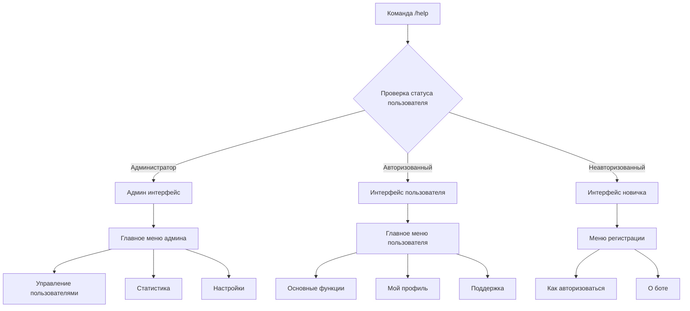
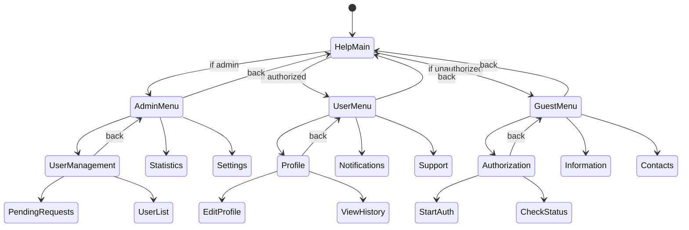
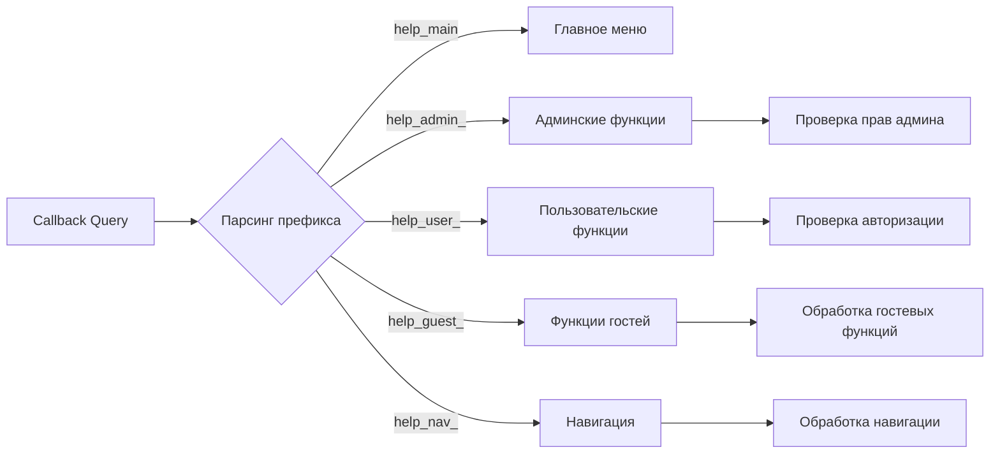
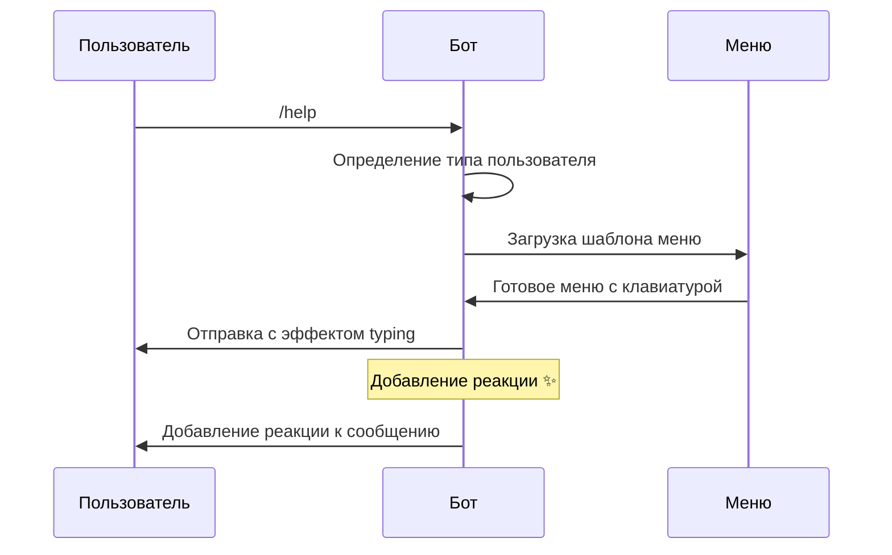
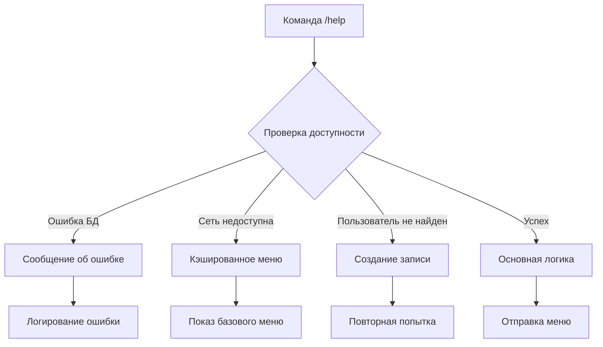
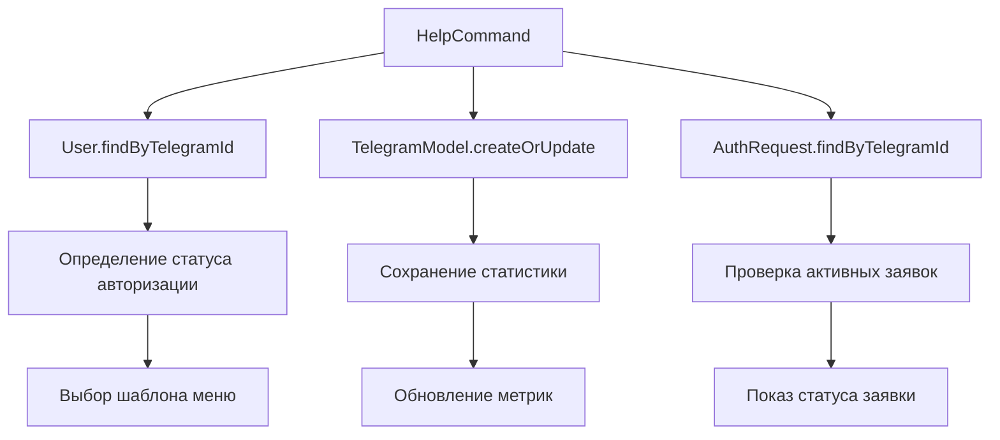

# Дизайн команды /help для Telegram бота

## Обзор

Команда `/help` является ключевым элементом пользовательского интерфейса бота, предоставляющим интуитивную навигацию и полную информацию о функциональности. Дизайн фокусируется на создании красивого, интерактивного и информативного интерфейса с поддержкой разных типов пользователей.

## Архитектура компонентов

### Структура команды помощи



### Компонентная архитектура

| Компонент | Назначение | Зависимости |
|-----------|-----------|-------------|
| `HelpCommandHandler` | Основной обработчик команды | `User`, `TelegramModel` |
| `MenuBuilder` | Построитель интерактивных меню | `InlineKeyboard` |
| `UserTypeDetector` | Определение типа пользователя | `User`, `ADMIN_ID` |
| `ContentProvider` | Поставщик контента для разных типов | `MessageTemplates` |
| `NavigationManager` | Управление навигацией по меню | `CallbackHandler` |

## Пользовательский интерфейс

### Главное меню для администратора

```
🏛️ ПАНЕЛЬ АДМИНИСТРАТОРА 👑

Добро пожаловать в панель управления ботом!

┌─── 👥 УПРАВЛЕНИЕ ───┐
│ • Заявки на авторизацию   │
│ • Список пользователей     │
│ • Заблокированные         │
└─────────────────────┘

┌─── 📊 АНАЛИТИКА ───┐
│ • Статистика бота          │
│ • Активность пользователей │
│ • Отчеты                  │
└─────────────────────┘

┌─── ⚙️ НАСТРОЙКИ ───┐
│ • Конфигурация бота       │
│ • Сообщения и тексты      │
│ • Резервное копирование   │
└─────────────────────┘

🆘 Экстренная помощь: /emergency
📞 Техподдержка: @admin_username
```

#### Клавиатура администратора

```
[👥 Пользователи] [📊 Статистика]
[⚙️ Настройки]   [🔔 Уведомления]
[📋 Заявки]      [🚫 Блокировка]
[💾 Бэкап]       [🔄 Обновить]
```

### Главное меню для авторизованного пользователя

```
🎯 ДОБРО ПОЖАЛОВАТЬ! ✨

Вы успешно авторизованы в системе!

┌─── 🎮 ОСНОВНЫЕ ФУНКЦИИ ───┐
│ • Мой профиль              │
│ • Настройки уведомлений    │
│ • История активности       │
└───────────────────────────┘

┌─── 📚 ИНФОРМАЦИЯ ───┐
│ • Правила использования    │
│ • Часто задаваемые вопросы │
│ • Новости и обновления     │
└─────────────────────┘

┌─── 🆘 ПОДДЕРЖКА ───┐
│ • Связаться с админом      │
│ • Сообщить о проблеме      │
│ • Предложить улучшение     │
└─────────────────────┘

📅 Последний вход: {дата_входа}
🏆 Статус: Авторизованный пользователь
```

#### Клавиатура авторизованного пользователя

```
[👤 Профиль]     [⚙️ Настройки]
[📋 История]     [📢 Новости]
[❓ FAQ]         [🆘 Поддержка]
[🔄 Обновить]    [🏠 Главная]
```

### Главное меню для неавторизованного пользователя

```
🚪 ДОБРО ПОЖАЛОВАТЬ В СИСТЕМУ! 🌟

Вы пока не авторизованы. Получите доступ ко всем функциям!

┌─── 🔐 АВТОРИЗАЦИЯ ───┐
│ • Как получить доступ      │
│ • Требования к заявке      │
│ • Статус моей заявки       │
└───────────────────────────┘

┌─── ℹ️ ИНФОРМАЦИЯ ───┐
│ • О проекте                │
│ • Возможности системы      │
│ • Правила сообщества       │
└─────────────────────┘

┌─── 📞 КОНТАКТЫ ───┐
│ • Связаться с админом      │
│ • Техническая поддержка    │
│ • Социальные сети          │
└─────────────────────┘

⏱️ Среднее время рассмотрения: 24 часа
✅ Процент одобренных заявок: 85%
```

#### Клавиатура неавторизованного пользователя

```
[🔐 Авторизоваться] [📋 Моя заявка]
[ℹ️ О системе]      [📖 Правила]
[📞 Контакты]       [❓ Помощь]
[🔄 Обновить]       [🔙 Назад]
```

## Навигационная структура

### Схема переходов



## Система обработки callback'ов

### Структура callback данных

| Префикс | Назначение | Пример |
|---------|-----------|---------|
| `help_main` | Возврат в главное меню | `help_main` |
| `help_admin_` | Админские функции | `help_admin_users` |
| `help_user_` | Пользовательские функции | `help_user_profile` |
| `help_guest_` | Функции для гостей | `help_guest_auth` |
| `help_nav_` | Навигационные элементы | `help_nav_back_main` |

### Обработчики навигации



## Мультимедийный контент

### Использование эмодзи и символов

| Категория | Эмодзи | Назначение |
|-----------|--------|-----------|
| Статус | ✅❌⏳🔒🔓 | Индикация состояния |
| Навигация | 🏠🔙⬅️➡️🔄 | Элементы навигации |
| Функции | 👤⚙️📊📋💾 | Функциональные кнопки |
| Декор | 🌟✨🎯🎮🏆 | Визуальное оформление |

### Анимационные эффекты



## Персонализация контента

### Динамические элементы

| Элемент | Источник данных | Формат |
|---------|----------------|--------|
| Имя пользователя | `first_name` | "Привет, {имя}!" |
| Дата регистрации | `created_at` | "С нами с {дата}" |
| Статус заявки | `auth_requests.status` | "Статус: {статус}" |
| Время последнего входа | `last_seen` | "Последний раз: {время}" |

### Локализация сообщений

```
Базовые шаблоны:
- welcome_admin: "🏛️ ПАНЕЛЬ АДМИНИСТРАТОРА 👑"
- welcome_user: "🎯 ДОБРО ПОЖАЛОВАТЬ! ✨"
- welcome_guest: "🚪 ДОБРО ПОЖАЛОВАТЬ В СИСТЕМУ! 🌟"

Персонализированные элементы:
- user_greeting: "Привет, {first_name}!"
- last_seen: "Последний вход: {formatted_date}"
- member_since: "С нами с {registration_date}"
```

## Обработка ошибок и edge cases

### Сценарии обработки ошибок



### Fallback механизмы

| Ситуация | Действие | Сообщение |
|----------|----------|-----------|
| БД недоступна | Показать базовое меню | "⚠️ Временные технические работы" |
| Неизвестный пользователь | Создать запись | "📝 Инициализация профиля..." |
| Ошибка отправки | Повторить попытку | "🔄 Попробуем еще раз..." |
| Timeout | Сократить контент | "⚡ Быстрое меню помощи" |

## Аналитика и метрики

### Отслеживаемые события

```mermaid
graph LR
    A[/help команда] --> B[Логирование]
    B --> C[Счетчик использований]
    B --> D[Время ответа]
    B --> E[Тип пользователя]
    B --> F[Выбранные опции]
    
    C --> G[Статистика популярности]
    D --> H[Метрики производительности]
    E --> I[Анализ аудитории]
    F --> J[Оптимизация меню]
```

### Метрики для мониторинга

| Метрика | Описание | Цель |
|---------|----------|------|
| `help_command_usage` | Количество использований /help | > 10/день |
| `menu_navigation_depth` | Глубина навигации пользователей | < 3 уровня |
| `callback_response_time` | Время ответа на callback | < 2 сек |
| `error_rate` | Процент ошибок при обработке | < 5% |

## Интеграция с существующей системой

### Точки интеграции



### Модификации существующего кода

| Файл | Изменения | Назначение |
|------|-----------|-----------|
| `app.js` | Добавить обработчик `/help` | Основная логика команды |
| `app.js` | Расширить callback handlers | Навигация по меню |
| `user.js` | Добавить метод `getHelpMenuType()` | Определение типа меню |
| `models/` | Создать `HelpMetrics.js` | Сбор статистики использования |

## Тестирование

### Unit тесты

```
Тестируемые компоненты:
- HelpCommandHandler.getMenuForUserType()
- MenuBuilder.buildAdminMenu()
- NavigationManager.handleCallback()
- ContentProvider.getPersonalizedContent()

Сценарии тестирования:
- Админ получает админское меню
- Авторизованный пользователь получает пользовательское меню
- Неавторизованный получает гостевое меню
- Обработка невалидных callback'ов
- Fallback при ошибках БД
```

### Интеграционные тесты

```
Полные сценарии:
1. Новый пользователь -> /help -> гостевое меню -> авторизация
2. Авторизованный -> /help -> пользовательское меню -> профиль
3. Админ -> /help -> админское меню -> управление пользователями
4. Навигация по всем уровням меню
5. Обработка ошибок и восстановление
```