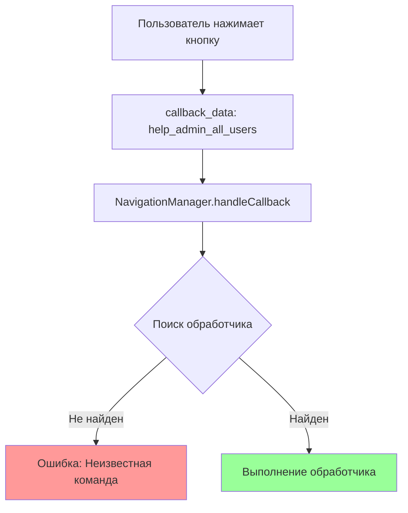
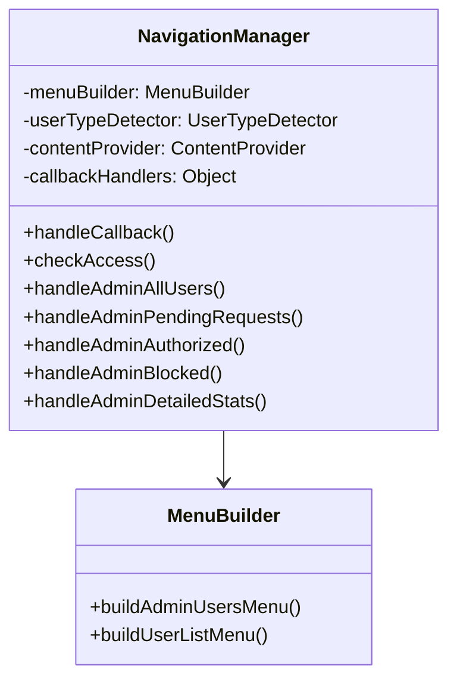
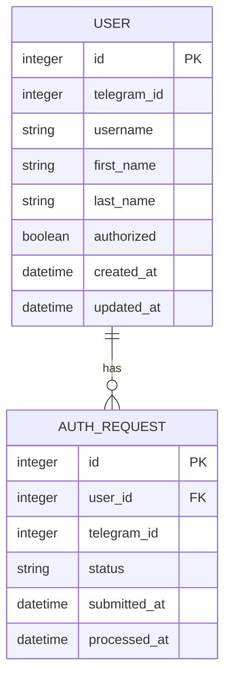

# Исправление кнопки "Все пользователи" в меню /help

## Обзор

В команде `/help` в разделе "Управление пользователями" кнопка "Все пользователи" не работает из-за отсутствующих обработчиков callback-запросов в NavigationManager. Необходимо добавить недостающие обработчики для корректной работы административного меню пользователей.

## Архитектура

### Текущая проблема

В `MenuBuilder.buildAdminUsersMenu()` определены кнопки с callback_data, но в `NavigationManager` отсутствуют соответствующие обработчики:



### Недостающие обработчики

В `callbackHandlers` отсутствуют следующие обработчики для меню управления пользователями:

| Callback Data | Описание | Статус |
|---------------|----------|---------|
| `help_admin_all_users` | Показать всех пользователей | ❌ Отсутствует |
| `help_admin_pending_requests` | Заявки на рассмотрение | ❌ Отсутствует |
| `help_admin_authorized` | Авторизованные пользователи | ❌ Отсутствует |
| `help_admin_blocked` | Заблокированные пользователи | ❌ Отсутствует |
| `help_admin_detailed_stats` | Детальная статистика | ❌ Отсутствует |

## Архитектура компонентов

### NavigationManager
Компонент отвечает за обработку callback-запросов от inline-кнопок:



### Модель данных пользователей



## Реализация обработчиков

### 1. Обработчик всех пользователей

Функция `handleAdminAllUsers` должна:
- Получить список всех пользователей из базы данных
- Построить пагинированное меню с информацией о пользователях
- Предоставить кнопки для управления каждым пользователем

### 2. Обработчик ожидающих заявок

Функция `handleAdminPendingRequests` должна:
- Получить список заявок со статусом 'pending'
- Показать детальную информацию о каждой заявке
- Предоставить кнопки для одобрения/отклонения

### 3. Обработчик авторизованных пользователей

Функция `handleAdminAuthorized` должна:
- Получить список пользователей с `authorized = 1`
- Показать статистику авторизованных пользователей
- Предоставить возможность управления авторизацией

### 4. Обработчик заблокированных пользователей

Функция `handleAdminBlocked` должна:
- Получить список заблокированных пользователей
- Предоставить возможность разблокировки

### 5. Обработчик детальной статистики

Функция `handleAdminDetailedStats` должна:
- Показать детальную статистику системы
- Графики активности пользователей
- Метрики использования

## Структура меню пользователей

### Главное меню управления пользователями
```
📊 УПРАВЛЕНИЕ ПОЛЬЗОВАТЕЛЯМИ

📊 Статистика:
• Всего пользователей: 15
• Авторизованных: 12
• Ожидающих заявок: 2
• Заблокированных: 1

🔔 У вас 2 новых заявок на рассмотрение!

[📋 Заявки (2)] [👥 Все пользователи]
[✅ Авторизованные] [🚫 Заблокированные]
[📈 Детальная статистика]
[🔙 Назад в админ меню]
```

### Меню списка пользователей
```
👥 ВСЕ ПОЛЬЗОВАТЕЛИ (страница 1/3)

1️⃣ @username1 (Иван Петров)
   📅 Рег: 15.12.2023 | ✅ Авторизован

2️⃣ @username2 (Мария Сидорова)  
   📅 Рег: 14.12.2023 | ⏳ Ожидает

3️⃣ @username3 (Алексей Иванов)
   📅 Рег: 13.12.2023 | 🚫 Заблокирован

[⬅️ Пред.] [Стр. 1/3] [След. ➡️]
[🔍 Поиск] [📊 Статистика] [🔙 Назад]
```

## Интеграция с базой данных

### Запросы к модели User
```javascript
// Получить всех пользователей с пагинацией
User.findAll({ limit, offset, orderBy: 'created_at' })

// Получить количество пользователей по статусу
User.countByStatus(status)

// Получить авторизованных пользователей
User.findAuthorized()

// Получить заблокированных пользователей (потребуется добавить поле blocked)
User.findBlocked()
```

### Запросы к модели AuthRequest
```javascript
// Получить ожидающие заявки
AuthRequest.findPending()

// Получить статистику заявок
AuthRequest.getStatistics()
```

## Обработка ошибок

### Механизм fallback
При ошибке загрузки данных пользователей:
1. Показать сообщение об ошибке
2. Предложить повторить попытку
3. Записать ошибку в лог
4. Отправить уведомление администратору

### Валидация доступа
Все административные функции должны:
1. Проверять тип пользователя (admin)
2. Валидировать права доступа
3. Логировать все административные действия

## Пользовательский интерфейс

### Принципы дизайна
1. **Консистентность**: Все меню используют единый стиль эмодзи и текста
2. **Навигация**: В каждом подменю есть кнопка "Назад"
3. **Информативность**: Показывается актуальная статистика
4. **Интерактивность**: Кнопки с понятными действиями

### Цветовая схема эмодзи
- 👥 - Пользователи
- ✅ - Авторизованные  
- 🚫 - Заблокированные
- ⏳ - Ожидающие
- 📊 - Статистика
- 🔙 - Навигация назад
- 🔄 - Обновление

## Логирование и метрики

### Отслеживание действий администратора
```javascript
// Запись в HelpMetrics при каждом административном действии
HelpMetrics.record({
    telegram_id: adminId,
    user_type: 'admin',
    menu_section: 'admin_users',
    action: 'view_all_users',
    response_time: responseTime
});
```

### Аудит пользовательских операций
- Просмотр списка пользователей
- Изменение статуса авторизации
- Блокировка/разблокировка пользователей
- Обработка заявок

## Тестирование

### Модульные тесты
Необходимо протестировать:
1. Корректность обработки callback-запросов
2. Пагинацию списка пользователей
3. Валидацию прав доступа
4. Обработку ошибок базы данных

### Интеграционные тесты
1. Взаимодействие с Telegram Bot API
2. Корректность обновления inline-клавиатур
3. Переходы между меню

### Сценарии тестирования
1. **Успешный путь**: Администратор просматривает всех пользователей → видит список → переходит между страницами
2. **Обработка ошибок**: База данных недоступна → показывается сообщение об ошибке → предлагается повторить
3. **Проверка прав**: Обычный пользователь пытается получить доступ → получает отказ в доступе