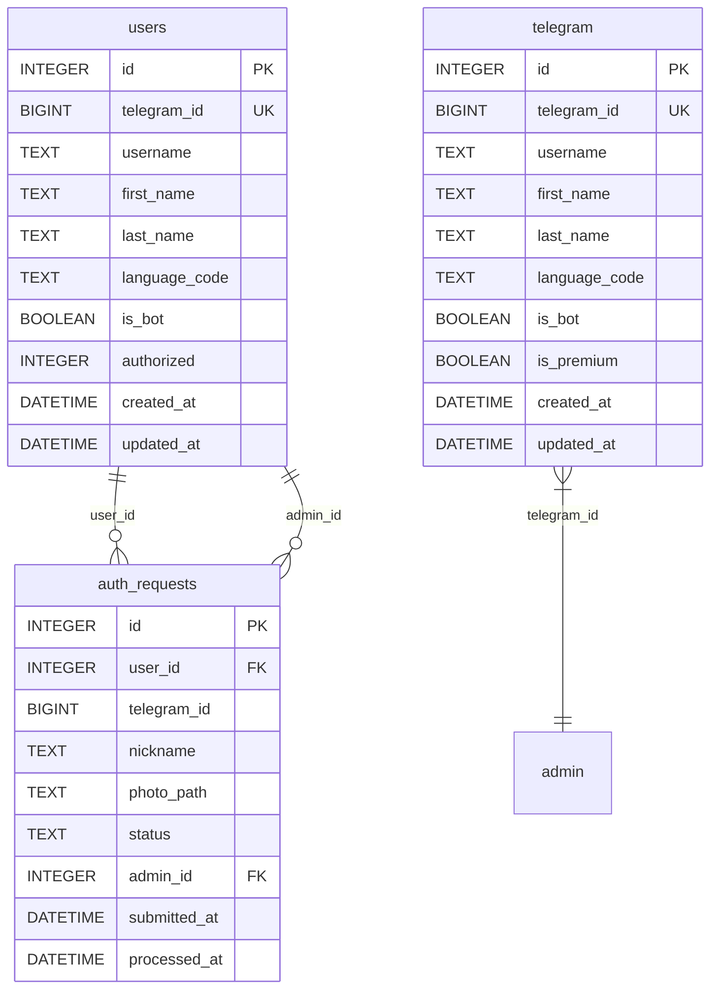
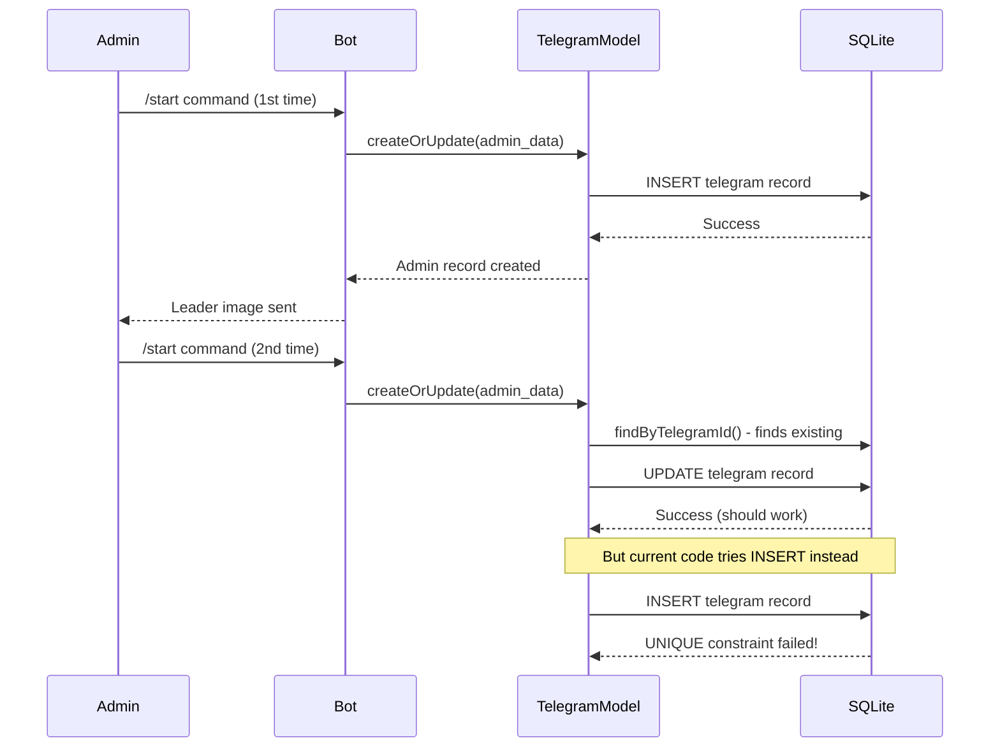
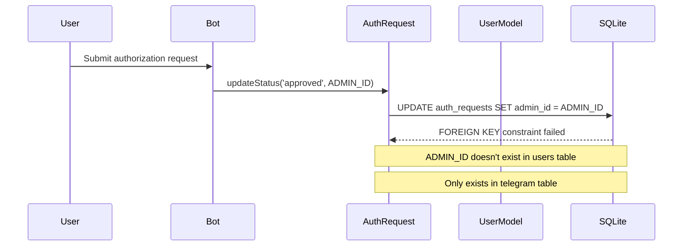

# Telegram Bot Debug Analysis & System Validation

## Overview

This document provides a comprehensive analysis and debugging strategy for the tgai Telegram bot system experiencing multiple critical errors. The primary issues include database constraint violations, duplicate record insertions, and foreign key reference failures that prevent normal operation of the authorization workflow.

## Technology Stack

- **Runtime**: Node.js with node-telegram-bot-api
- **Database**: SQLite with manual migration system
- **Models**: Custom model classes (User, TelegramModel, AuthRequest)
- **Architecture**: Monolithic bot application with layered database access

## Critical Error Analysis

### 1. Primary Error: UNIQUE Constraint Violation

```
Error: SQLITE_CONSTRAINT: UNIQUE constraint failed: telegram.telegram_id
```

**Root Cause**: The TelegramModel.createOrUpdate() method attempts to INSERT records even when a record with the same telegram_id already exists.

**Impact**: Admin cannot use /start command multiple times without errors.

### 2. Secondary Error: Foreign Key Constraint Failure

```
Error: Failed to update auth request status: SQLITE_CONSTRAINT: FOREIGN KEY constraint failed
```

**Root Cause**: The auth_requests table references admin_id as a foreign key to users(id), but ADMIN_ID (6677130873) doesn't exist in the users table.

**Impact**: Authorization approval/rejection workflow completely broken.

## Database Schema Analysis

### Current Database Structure



### Schema Issues Identified

1. **Duplicate User Storage**: Both `users` and `telegram` tables store similar user information
2. **Missing Admin Record**: ADMIN_ID not properly inserted into users table
3. **Foreign Key Mismatch**: admin_id references users.id but admin exists only in telegram table

## Error Reproduction Flow



## Authorization Workflow Issues

### Foreign Key Constraint Problem



## System Validation Testing Strategy

### 1. Database Constraint Testing

| Test Case | Expected Behavior | Current Result | Fix Required |
|-----------|------------------|----------------|--------------|
| Admin /start (first time) | Create telegram record | ✅ Works | None |
| Admin /start (repeated) | Update existing record | ❌ UNIQUE constraint error | Fix createOrUpdate logic |
| User authorization submission | Create auth_request | ✅ Works | None |
| Admin approval action | Update request status | ❌ FOREIGN KEY error | Create admin user record |

### 2. Authorization Flow Testing Matrix

| User Type | Action | Expected Result | Current Status | Critical Issues |
|-----------|--------|----------------|----------------|-----------------|
| New User | /start | Show newcomers image + auth button | ✅ Working | None |
| Authorized User | /start | Show authorized image | ✅ Working | None |
| Admin | /start (first) | Create telegram record + show leader image | ✅ Working | None |
| Admin | /start (repeat) | Update telegram record + show leader image | ❌ Database error | UNIQUE constraint |
| User | Start authorization | Begin nickname flow | ✅ Working | None |
| User | Submit nickname | Request photo | ✅ Working | None |
| User | Submit photo | Create auth_request + notify admin | ✅ Working | None |
| Admin | Approve request | Update status + authorize user | ❌ FK constraint | Missing admin user |
| Admin | Reject request | Update status + notify user | ❌ FK constraint | Missing admin user |

### 3. Session Management Testing

| Session State | Trigger | Expected Transition | Validation Required |
|---------------|---------|-------------------|-------------------|
| None | start_authorization callback | AWAITING_NICKNAME | ✅ Working |
| AWAITING_NICKNAME | Valid nickname text | AWAITING_PHOTO | ✅ Working |
| AWAITING_NICKNAME | Invalid nickname | Stay in AWAITING_NICKNAME | ✅ Working |
| AWAITING_PHOTO | Photo message | PROCESSING → Complete | ✅ Working |
| AWAITING_PHOTO | Non-photo message | Stay in AWAITING_PHOTO | ✅ Working |

## Root Cause Fix Strategy

### 1. TelegramModel.createOrUpdate() Fix

**Problem**: Method always attempts INSERT for new records, even after finding existing ones.

**Current Logic**:
```javascript
const existing = await this.findByTelegramId(telegram_id);
if (existing) {
    // Update path - works correctly
} else {
    // Insert path - executes even when record exists
}
```

**Fix Required**: Ensure findByTelegramId() properly returns existing records.

### 2. Admin User Record Creation

**Problem**: ADMIN_ID exists in telegram table but not in users table, breaking foreign key references.

**Solution**: Create corresponding user record for admin during startup.

### 3. Database Consistency Fixes

**Immediate Actions**:
1. Fix TelegramModel.createOrUpdate() duplicate insertion logic
2. Create admin user record in users table
3. Ensure proper foreign key relationships
4. Add database integrity checks

## Implementation Fixes

### Fix 1: TelegramModel Logic Correction

```javascript
async createOrUpdate(telegramData) {
    const { telegram_id, ...otherData } = telegramData;
    
    try {
        const existing = await this.findByTelegramId(telegram_id);
        
        if (existing) {
            // UPDATE existing record
            await database.run(/* UPDATE query */);
            return await this.findByTelegramId(telegram_id);
        } else {
            // INSERT new record only if not found
            const result = await database.run(/* INSERT query */);
            return await this.findById(result.id);
        }
    } catch (error) {
        console.error('Error in createOrUpdate:', error);
        throw error;
    }
}
```

### Fix 2: Admin User Initialization

```javascript
async function initializeAdmin() {
    try {
        // Check if admin user exists in users table
        let adminUser = await User.findByTelegramId(ADMIN_ID);
        
        if (!adminUser) {
            // Create admin user record
            adminUser = await User.create({
                telegram_id: ADMIN_ID,
                username: 'admin',
                first_name: 'Admin',
                authorized: 1
            });
            console.log('Admin user created in users table');
        }
        
        return adminUser;
    } catch (error) {
        console.error('Error initializing admin:', error);
        throw error;
    }
}
```

### Fix 3: Database Integrity Checks

```javascript
async function validateDatabaseIntegrity() {
    try {
        // Check for orphaned records
        const orphanedRequests = await database.all(
            'SELECT * FROM auth_requests WHERE admin_id NOT IN (SELECT id FROM users)'
        );
        
        if (orphanedRequests.length > 0) {
            console.warn(`Found ${orphanedRequests.length} auth_requests with invalid admin_id`);
        }
        
        // Check for duplicate telegram_ids
        const duplicates = await database.all(
            'SELECT telegram_id, COUNT(*) as count FROM telegram GROUP BY telegram_id HAVING count > 1'
        );
        
        if (duplicates.length > 0) {
            console.warn(`Found ${duplicates.length} duplicate telegram_id records`);
        }
        
        return {
            orphanedRequests: orphanedRequests.length,
            duplicates: duplicates.length
        };
    } catch (error) {
        console.error('Database integrity check failed:', error);
        throw error;
    }
}
```

## Testing Validation Protocol

### 1. Pre-Fix Validation
- [ ] Reproduce UNIQUE constraint error with admin /start
- [ ] Reproduce FOREIGN KEY error with auth approval
- [ ] Document exact error conditions
- [ ] Verify database state before fixes

### 2. Post-Fix Validation
- [ ] Admin can use /start command multiple times without errors
- [ ] Authorization approval/rejection workflow functions correctly
- [ ] All database constraints are satisfied
- [ ] No data loss or corruption
- [ ] Session management works across all states

### 3. Regression Testing
- [ ] New user authorization flow still works
- [ ] Existing authorized users still work
- [ ] Photo upload and storage functioning
- [ ] Admin notifications sent correctly
- [ ] Database migrations run successfully

## Error Monitoring Strategy

### 1. Enhanced Error Logging

```javascript
function setupErrorMonitoring() {
    // Database operation logging
    database.on('error', (error) => {
        console.error('Database error:', {
            message: error.message,
            code: error.code,
            errno: error.errno,
            stack: error.stack,
            timestamp: new Date().toISOString()
        });
    });
    
    // Bot error monitoring
    bot.on('polling_error', (error) => {
        console.error('Bot polling error:', {
            message: error.message,
            code: error.code,
            timestamp: new Date().toISOString()
        });
    });
}
```

### 2. Health Check Implementation

```javascript
async function performHealthCheck() {
    const health = {
        database: false,
        botConnection: false,
        adminUser: false,
        timestamp: new Date().toISOString()
    };
    
    try {
        // Database connectivity
        await database.get('SELECT 1');
        health.database = true;
        
        // Bot connectivity
        const botInfo = await bot.getMe();
        health.botConnection = !!botInfo.id;
        
        // Admin user exists
        const adminUser = await User.findByTelegramId(ADMIN_ID);
        health.adminUser = !!adminUser;
        
    } catch (error) {
        console.error('Health check failed:', error);
    }
    
    return health;
}
```

## Performance Optimization

### 1. Database Query Optimization

- Add indexes for frequently queried fields
- Implement connection pooling if needed
- Optimize findByTelegramId queries

### 2. Session Management Optimization

- Implement session timeout cleanup
- Add session persistence for bot restarts
- Optimize memory usage for user sessions

## Security Considerations

### 1. Input Validation
- Validate all user inputs before database operations
- Sanitize file paths for photo storage
- Implement rate limiting for authorization requests

### 2. Data Protection
- Secure storage of user photos
- Protect admin credentials
- Implement proper error message sanitization

This debugging analysis provides a complete roadmap for fixing the identified issues and establishing a robust validation framework for the Telegram bot system. The fixes address both immediate functional problems and long-term system reliability.