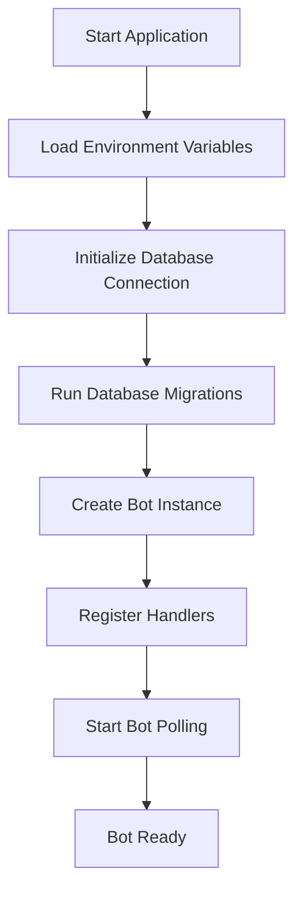
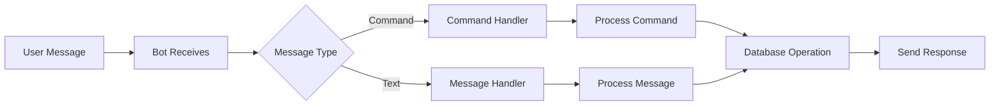

# Telegram Bot Node.js Project Initialization

## Overview

This document outlines the design for initializing a Node.js Telegram bot application with environment configuration and SQLite database integration. The project will serve as a foundation for building a scalable Telegram bot with persistent data storage capabilities.

### Project Goals
- Initialize a Node.js project structure for Telegram bot development
- Set up Telegram Bot API integration
- Configure environment variables management
- Implement SQLite database for data persistence
- Establish project foundation for future bot features

### Technology Stack
- **Runtime**: Node.js
- **Bot Framework**: Telegram Bot API
- **Database**: SQLite
- **Environment Management**: dotenv
- **Package Manager**: npm

## Architecture

### Project Structure
```
tgai/
├── src/
│   ├── bot/
│   │   ├── handlers/
│   │   │   ├── commands.js
│   │   │   └── messages.js
│   │   ├── middleware/
│   │   │   └── logging.js
│   │   └── bot.js
│   ├── database/
│   │   ├── models/
│   │   │   └── user.js
│   │   ├── migrations/
│   │   └── connection.js
│   ├── utils/
│   │   └── logger.js
│   └── app.js
├── config/
│   └── database.js
├── .env.example
├── .env
├── .gitignore
├── package.json
└── README.md
```

### Core Components

#### 1. Bot Module
- **bot.js**: Main bot instance and configuration
- **handlers/**: Command and message handlers
- **middleware/**: Bot middleware for logging, authentication

#### 2. Database Module
- **connection.js**: SQLite database connection setup
- **models/**: Data models and schemas
- **migrations/**: Database schema migrations

#### 3. Configuration
- **Environment variables**: Bot token, database path, logging level
- **Database configuration**: SQLite file location and settings

## Bot Architecture

### Bot Initialization Flow


### Command Handling System


## Environment Configuration

### Required Environment Variables
| Variable | Description | Example |
|----------|-------------|---------|
| `BOT_TOKEN` | Telegram Bot API token | `123456789:ABCdefGHIjklMNOpqrsTUVwxyz` |
| `DATABASE_PATH` | SQLite database file path | `./data/bot.sqlite` |
| `LOG_LEVEL` | Application logging level | `info` |
| `NODE_ENV` | Environment mode | `development` |

### Environment Setup
- `.env.example`: Template file with variable names
- `.env`: Actual environment variables (git-ignored)
- Environment validation on application startup

## Database Design

### SQLite Schema

#### Users Table
```sql
CREATE TABLE users (
    id INTEGER PRIMARY KEY AUTOINCREMENT,
    telegram_id BIGINT UNIQUE NOT NULL,
    username TEXT,
    first_name TEXT,
    last_name TEXT,
    language_code TEXT,
    is_bot BOOLEAN DEFAULT FALSE,
    created_at DATETIME DEFAULT CURRENT_TIMESTAMP,
    updated_at DATETIME DEFAULT CURRENT_TIMESTAMP
);
```

#### Messages Table
```sql
CREATE TABLE messages (
    id INTEGER PRIMARY KEY AUTOINCREMENT,
    user_id INTEGER,
    message_id BIGINT,
    text TEXT,
    message_type TEXT,
    created_at DATETIME DEFAULT CURRENT_TIMESTAMP,
    FOREIGN KEY (user_id) REFERENCES users (id)
);
```

### Database Operations
- **Connection Management**: Single SQLite connection with proper error handling
- **Migration System**: Incremental schema updates
- **Query Builders**: Prepared statements for security
- **Transaction Support**: For complex operations

## Bot Handlers Architecture

### Command Handlers
```mermaid
graph TD
    A[/start] --> B[Register User]
    C[/help] --> D[Show Help Menu]
    E[/settings] --> F[User Preferences]
    B --> G[Welcome Message]
    D --> G
    F --> G
```

### Handler Structure
- **Command Registration**: Automatic command discovery
- **Middleware Chain**: Logging, authentication, rate limiting
- **Error Handling**: Graceful error responses
- **Response Templates**: Consistent message formatting

## API Integration Layer

### Telegram Bot API Client
- **HTTP Client**: axios for API requests
- **Rate Limiting**: Respect Telegram API limits
- **Error Handling**: Retry logic and fallback responses
- **Webhook Support**: Future webhook implementation capability

### Bot API Methods
| Method | Purpose | Implementation |
|--------|---------|----------------|
| `sendMessage` | Send text messages | Basic text responses |
| `sendPhoto` | Send images | Media handling |
| `sendDocument` | Send files | File upload support |
| `editMessageText` | Edit messages | Message updates |
| `deleteMessage` | Delete messages | Message management |

## Error Handling & Logging

### Error Management
- **Global Error Handler**: Catch unhandled errors
- **Bot Error Handling**: Telegram API errors
- **Database Error Handling**: SQLite connection issues
- **Graceful Degradation**: Fallback responses

### Logging Strategy
- **Structured Logging**: JSON format for production
- **Log Levels**: Error, Warning, Info, Debug
- **Log Rotation**: File-based logging with rotation
- **Bot Activity Logging**: User interactions and commands

## Security Considerations

### Bot Token Security
- Environment variable storage
- Token validation on startup
- Secure token transmission

### Database Security
- SQL injection prevention (prepared statements)
- File permission management
- Database backup strategy

### Input Validation
- Message content sanitization
- Command parameter validation
- File upload restrictions

## Testing Strategy

### Unit Testing
- **Bot Handlers**: Command and message processing
- **Database Operations**: CRUD operations
- **Utility Functions**: Helper methods

### Integration Testing
- **Bot API Integration**: Mock Telegram API responses
- **Database Integration**: In-memory SQLite for tests
- **End-to-End Scenarios**: Complete user flows

### Test Structure
```
tests/
├── unit/
│   ├── bot/
│   │   └── handlers.test.js
│   └── database/
│       └── models.test.js
├── integration/
│   └── bot-api.test.js
└── fixtures/
    └── test-data.json
```

## Development Workflow

### Package Dependencies
```json
{
  "dependencies": {
    "node-telegram-bot-api": "^0.64.0",
    "sqlite3": "^5.1.6",
    "dotenv": "^16.3.1",
    "winston": "^3.11.0"
  },
  "devDependencies": {
    "jest": "^29.7.0",
    "nodemon": "^3.0.1",
    "eslint": "^8.54.0"
  }
}
```

### NPM Scripts
```json
{
  "scripts": {
    "start": "node src/app.js",
    "dev": "nodemon src/app.js",
    "test": "jest",
    "test:watch": "jest --watch",
    "lint": "eslint src/",
    "db:migrate": "node scripts/migrate.js"
  }
}
```

### Development Setup
1. **Project Initialization**: `npm init` with package.json configuration
2. **Dependency Installation**: Install core and development dependencies
3. **Environment Setup**: Create .env file with bot token
4. **Database Initialization**: Run initial migration scripts
5. **Bot Registration**: Create bot with @BotFather
6. **Development Server**: Start with nodemon for auto-reload