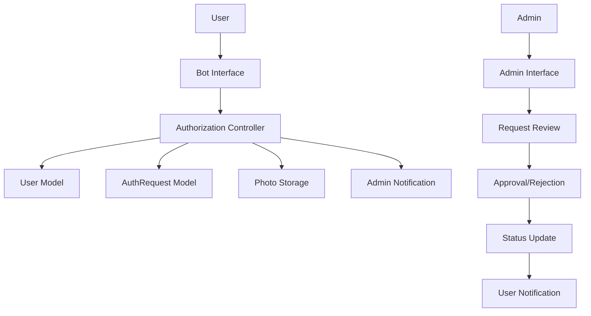
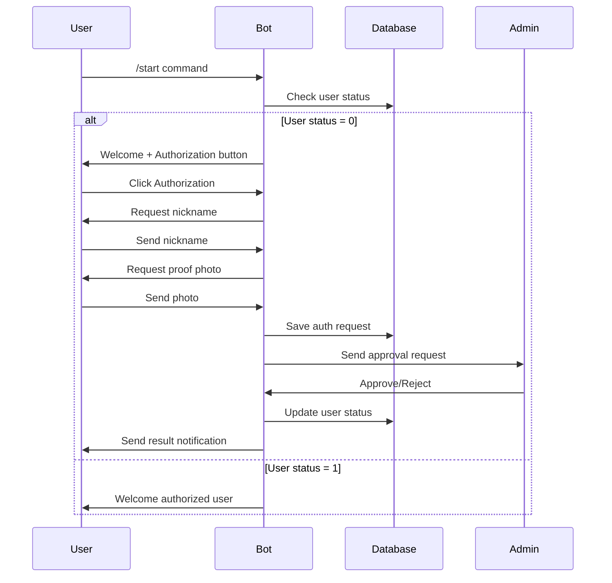
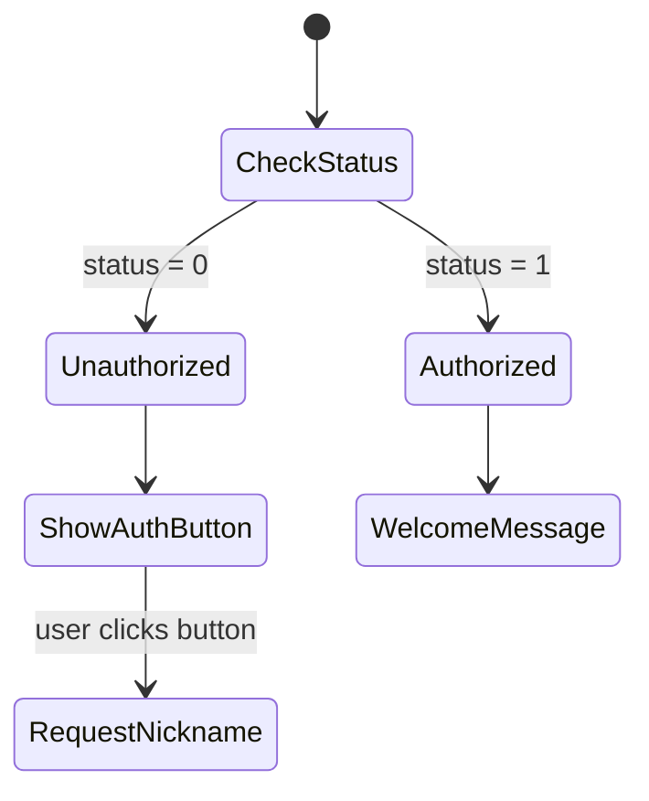
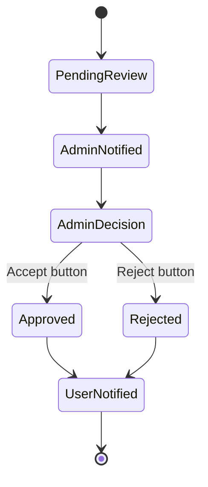

# Telegram Bot User Authorization System Design

## Overview

This design document outlines the user authorization system for the Telegram bot that manages family member authentication. The system implements a workflow where unauthorized users (status 0) can request authorization by providing their nickname and proof photo, which is then reviewed and approved/rejected by administrators.

## Architecture

### System Components



### Data Flow Architecture



## User Authorization Workflow

### Step 1: User Status Check
- When user sends `/start` command, bot checks `users.authorized` field
- Status 0: Unauthorized user → Show authorization button
- Status 1: Authorized user → Show welcome message

### Step 2: Authorization Request Flow

#### 2.1 Initial Request


#### 2.2 Data Collection Process
- **Nickname Input**: User enters nickname in format `Name_Surname`
- **Photo Submission**: User sends compressed Telegram photo
- **Instruction Display**: Bot shows `/fam`, `/time` command instructions
- **Data Validation**: Verify nickname format and photo presence

#### 2.3 Admin Review Process


## Component Architecture

### Bot Message Handlers

#### Start Command Handler
- Detects user authorization status
- Routes to appropriate response flow
- Creates inline keyboard for unauthorized users

#### Authorization Flow Handler
- Manages multi-step conversation state
- Validates user input at each step
- Handles photo upload and storage

#### Admin Interface Handler
- Processes admin approval/rejection callbacks
- Updates user authorization status
- Sends notification to requesting user

### Data Models Extensions

#### User Model Updates
| Field | Type | Description |
|-------|------|-------------|
| `authorized` | INTEGER | 0 = unauthorized, 1 = authorized |
| `telegram_id` | BIGINT | Telegram user identifier |
| `username` | TEXT | Telegram username |

#### AuthRequest Model Structure
| Field | Type | Description |
|-------|------|-------------|
| `id` | INTEGER | Primary key |
| `user_id` | INTEGER | Foreign key to users table |
| `telegram_id` | BIGINT | Telegram user ID |
| `nickname` | TEXT | User-provided nickname (Name_Surname) |
| `photo_path` | TEXT | Path to stored proof photo |
| `status` | TEXT | pending/approved/rejected |
| `admin_id` | INTEGER | Processing admin ID |
| `submitted_at` | DATETIME | Request submission time |
| `processed_at` | DATETIME | Admin decision time |

### Conversation State Management

#### State Flow Controller
```javascript
// Conversation states for authorization flow
const CONVERSATION_STATES = {
    AWAITING_NICKNAME: 'awaiting_nickname',
    AWAITING_PHOTO: 'awaiting_photo',
    PROCESSING: 'processing'
};
```

#### Session Data Structure
```javascript
// Temporary session storage for user conversations
const userSessions = {
    [telegramId]: {
        state: 'awaiting_nickname',
        nickname: null,
        startTime: Date.now()
    }
};
```

## User Interface Design

### Unauthorized User Interface

#### Start Command Response
```
Message: "Добро пожаловать! Вы пока не авторизованы 🔒"
Image: newcomers.png
Inline Keyboard: ["Авторизация"]
```

#### Authorization Request Interface
```
Step 1: "Введите ваш никнейм в формате Name_Surname"
Step 2: "Отправьте фотографию (сжатую для Telegram)"
Step 3: "Инструкция: напишите /fam, затем /time и отправьте скриншот"
```

### Admin Interface

#### New Request Notification
```
Новая заявка от [Name_Surname]
Telegram ID: [telegram_id]
Username: [@username]
[Photo attachment]

Inline Keyboard:
Row 1: [Принять] [Отказать]
```

#### Admin Action Callbacks
```javascript
// Callback data format
approve_[request_id] // For approval
reject_[request_id]  // For rejection
```

## API Endpoints Reference

### Bot Command Handlers

#### /start Command
- **Purpose**: Initialize user session and check authorization
- **Response**: Status-appropriate welcome message with navigation
- **Authorization**: None required

#### Authorization Flow Commands
- **Trigger**: Inline button callback
- **Process**: Multi-step conversation handling
- **Validation**: Nickname format, photo presence

### Database Operations

#### User Authorization Methods
```javascript
// Check user authorization status
User.prototype.isAuthorized()

// Update user authorization
User.prototype.setAuthorized(status)

// Find users by authorization status
User.findAuthorized()
User.findUnauthorized()
```

#### Authorization Request Methods
```javascript
// Create new authorization request
AuthRequest.create({
    user_id, telegram_id, nickname, photo_path
})

// Find pending requests for admin
AuthRequest.findPending()

// Update request status
AuthRequest.prototype.updateStatus(status, adminId)
```

## Business Logic Layer

### Authorization Validation Rules

#### Nickname Validation
- **Format**: `Name_Surname` pattern
- **Requirements**: Alphabetic characters, single underscore separator
- **Validation**: Regex pattern `/^[A-Za-zА-Яа-я]+_[A-Za-zА-Яа-я]+$/`

#### Photo Validation
- **Type**: Telegram compressed photo
- **Storage**: Local file system with unique naming
- **Path Generation**: `photos/auth_requests/[timestamp]_[telegram_id].jpg`

### Request Processing Logic

#### Submission Process
1. Validate user input data
2. Store photo to file system
3. Create database record
4. Generate admin notification
5. Send confirmation to user

#### Admin Decision Process
1. Parse callback data to extract request ID
2. Update request status in database
3. Update user authorization status if approved
4. Send notification to requesting user
5. Clean up temporary data if rejected

### State Management Strategy

#### Conversation Session Handling
- **Storage**: In-memory Map for active sessions
- **Cleanup**: Automatic timeout after 30 minutes
- **Persistence**: Database storage for completed requests

#### Error Recovery
- **Invalid Input**: Prompt user to retry with guidance
- **Photo Upload Failure**: Request resubmission
- **Database Errors**: Log and notify admin

## Testing Strategy

### Unit Testing Components

#### User Model Tests
- Authorization status checks
- Status update operations
- User lookup methods

#### AuthRequest Model Tests
- Request creation and validation
- Status transition workflows
- Photo handling operations

#### Bot Handler Tests
- Command processing logic
- Conversation state management
- Admin callback processing

### Integration Testing Scenarios

#### Complete Authorization Flow
1. Unauthorized user starts conversation
2. Submits valid nickname and photo
3. Admin approves request
4. User status updated to authorized
5. User receives confirmation

#### Error Handling Flows
- Invalid nickname format handling
- Photo upload failure recovery
- Admin rejection notification
- Duplicate request prevention

### Testing Data Setup
```javascript
// Test user data
const testUsers = {
    unauthorized: {
        telegram_id: 123456789,
        authorized: 0
    },
    admin: {
        telegram_id: 987654321,
        authorized: 1
    }
};

// Test authorization requests
const testRequests = {
    pending: {
        nickname: "John_Doe",
        status: "pending",
        photo_path: "test_photo.jpg"
    }
};
```    AdminNotified --> AdminDecision
    AdminDecision --> Approved: Accept button
    AdminDecision --> Rejected: Reject button
    Approved --> UserNotified
    Rejected --> UserNotified
    UserNotified --> [*]
```

## Component Architecture

### Bot Message Handlers

#### Start Command Handler
- Detects user authorization status
- Routes to appropriate response flow
- Creates inline keyboard for unauthorized users

#### Authorization Flow Handler
- Manages multi-step conversation state
- Validates user input at each step
- Handles photo upload and storage

#### Admin Interface Handler
- Processes admin approval/rejection callbacks
- Updates user authorization status
- Sends notification to requesting user

### Data Models Extensions

#### User Model Updates
| Field | Type | Description |
|-------|------|-------------|
| `authorized` | INTEGER | 0 = unauthorized, 1 = authorized |
| `telegram_id` | BIGINT | Telegram user identifier |
| `username` | TEXT | Telegram username |

#### AuthRequest Model Structure
| Field | Type | Description |
|-------|------|-------------|
| `id` | INTEGER | Primary key |
| `user_id` | INTEGER | Foreign key to users table |
| `telegram_id` | BIGINT | Telegram user ID |
| `nickname` | TEXT | User-provided nickname (Name_Surname) |
| `photo_path` | TEXT | Path to stored proof photo |
| `status` | TEXT | pending/approved/rejected |
| `admin_id` | INTEGER | Processing admin ID |
| `submitted_at` | DATETIME | Request submission time |
| `processed_at` | DATETIME | Admin decision time |

### Conversation State Management

#### State Flow Controller
```javascript
// Conversation states for authorization flow
const CONVERSATION_STATES = {
    AWAITING_NICKNAME: 'awaiting_nickname',
    AWAITING_PHOTO: 'awaiting_photo',
    PROCESSING: 'processing'
};
```

#### Session Data Structure
```javascript
// Temporary session storage for user conversations
const userSessions = {
    [telegramId]: {
        state: 'awaiting_nickname',
        nickname: null,
        startTime: Date.now()
    }
};
```

## User Interface Design

### Unauthorized User Interface

#### Start Command Response
```
Message: "Добро пожаловать! Вы пока не авторизованы 🔒"
Image: newcomers.png
Inline Keyboard: ["Авторизация"]
```

#### Authorization Request Interface
```
Step 1: "Введите ваш никнейм в формате Name_Surname"
Step 2: "Отправьте фотографию (сжатую для Telegram)"
Step 3: "Инструкция: напишите /fam, затем /time и отправьте скриншот"
```

### Admin Interface

#### New Request Notification
```
Новая заявка от [Name_Surname]
Telegram ID: [telegram_id]
Username: [@username]
[Photo attachment]

Inline Keyboard:
Row 1: [Принять] [Отказать]
```

#### Admin Action Callbacks
```javascript
// Callback data format
approve_[request_id] // For approval
reject_[request_id]  // For rejection
```

## API Endpoints Reference

### Bot Command Handlers

#### /start Command
- **Purpose**: Initialize user session and check authorization
- **Response**: Status-appropriate welcome message with navigation
- **Authorization**: None required

#### Authorization Flow Commands
- **Trigger**: Inline button callback
- **Process**: Multi-step conversation handling
- **Validation**: Nickname format, photo presence

### Database Operations

#### User Authorization Methods
```javascript
// Check user authorization status
User.prototype.isAuthorized()

// Update user authorization
User.prototype.setAuthorized(status)

// Find users by authorization status
User.findAuthorized()
User.findUnauthorized()
```

#### Authorization Request Methods
```javascript
// Create new authorization request
AuthRequest.create({
    user_id, telegram_id, nickname, photo_path
})

// Find pending requests for admin
AuthRequest.findPending()

// Update request status
AuthRequest.prototype.updateStatus(status, adminId)
```

## Business Logic Layer

### Authorization Validation Rules

#### Nickname Validation
- **Format**: `Name_Surname` pattern
- **Requirements**: Alphabetic characters, single underscore separator
- **Validation**: Regex pattern `/^[A-Za-zА-Яа-я]+_[A-Za-zА-Яа-я]+$/`

#### Photo Validation
- **Type**: Telegram compressed photo
- **Storage**: Local file system with unique naming
- **Path Generation**: `photos/auth_requests/[timestamp]_[telegram_id].jpg`

### Request Processing Logic

#### Submission Process
1. Validate user input data
2. Store photo to file system
3. Create database record
4. Generate admin notification
5. Send confirmation to user

#### Admin Decision Process
1. Parse callback data to extract request ID
2. Update request status in database
3. Update user authorization status if approved
4. Send notification to requesting user
5. Clean up temporary data if rejected

### State Management Strategy

#### Conversation Session Handling
- **Storage**: In-memory Map for active sessions
- **Cleanup**: Automatic timeout after 30 minutes
- **Persistence**: Database storage for completed requests

#### Error Recovery
- **Invalid Input**: Prompt user to retry with guidance
- **Photo Upload Failure**: Request resubmission
- **Database Errors**: Log and notify admin

## Testing Strategy

### Unit Testing Components

#### User Model Tests
- Authorization status checks
- Status update operations
- User lookup methods

#### AuthRequest Model Tests
- Request creation and validation
- Status transition workflows
- Photo handling operations

#### Bot Handler Tests
- Command processing logic
- Conversation state management
- Admin callback processing

### Integration Testing Scenarios

#### Complete Authorization Flow
1. Unauthorized user starts conversation
2. Submits valid nickname and photo
3. Admin approves request
4. User status updated to authorized
5. User receives confirmation

#### Error Handling Flows
- Invalid nickname format handling
- Photo upload failure recovery
- Admin rejection notification
- Duplicate request prevention

### Testing Data Setup
```javascript
// Test user data
const testUsers = {
    unauthorized: {
        telegram_id: 123456789,
        authorized: 0
    },
    admin: {
        telegram_id: 987654321,
        authorized: 1
    }
};

// Test authorization requests
const testRequests = {
    pending: {
        nickname: "John_Doe",
        status: "pending",
        photo_path: "test_photo.jpg"
    }
};
```


