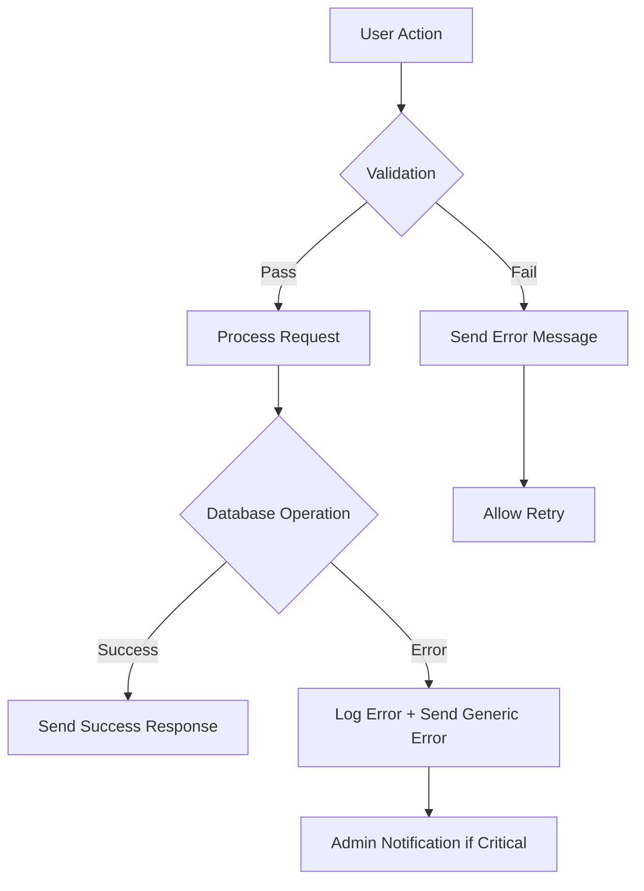

# User Authentication Bot Design

## Overview

This document outlines the design for implementing a comprehensive user authentication system in the Telegram bot. The system manages user authorization through a multi-step verification process involving nickname submission, photo proof, and administrative approval.

## Technology Stack & Dependencies

- **Runtime**: Node.js with existing sqlite3 database
- **Telegram API**: node-telegram-bot-api for bot interactions
- **Database**: SQLite with existing user authorization schema
- **Storage**: File system for photo storage
- **Authentication Flow**: Multi-step verification with admin approval

## Component Architecture

### Core Components


### Component Hierarchy

1. **Telegram Bot Interface**
   - Message handlers for /start command
   - Inline keyboard management
   - Photo upload handling
   - Admin notification system

2. **Authentication Controller**
   - User status verification
   - Authorization flow orchestration
   - Response formatting

3. **Authentication Service**
   - Multi-step auth workflow management
   - Validation logic
   - State management

4. **Data Layer**
   - User model extensions
   - Authentication request tracking
   - Photo metadata storage

## Database Schema Extensions

### New Table: auth_requests

```sql
CREATE TABLE auth_requests (
    id INTEGER PRIMARY KEY AUTOINCREMENT,
    user_id INTEGER NOT NULL,
    telegram_id BIGINT NOT NULL,
    nickname TEXT NOT NULL,
    photo_path TEXT NOT NULL,
    status TEXT DEFAULT 'pending', -- pending, approved, rejected
    admin_id INTEGER,
    submitted_at DATETIME DEFAULT CURRENT_TIMESTAMP,
    processed_at DATETIME,
    FOREIGN KEY (user_id) REFERENCES users(id),
    FOREIGN KEY (admin_id) REFERENCES users(id)
);
```

### Extended User Model Properties


## Authentication Flow Architecture

### User Authentication Workflow


### Administrative Approval Interface


## API Endpoints & Message Handlers

### Bot Command Handlers

| Command/Action | Handler Function | Description |
|----------------|-----------------|-------------|
| `/start` | handleStartCommand | Check auth status, show appropriate interface |
| Inline Button: "Авторизация" | handleAuthButton | Initialize auth flow |
| Text Input | handleNicknameInput | Process nickname submission |
| Photo Upload | handlePhotoUpload | Process photo submission |
| Admin Button: "Принять" | handleApprovalButton | Approve auth request |
| Admin Button: "Отказать" | handleRejectionButton | Reject auth request |

### Service Methods

```javascript
// AuthService methods
class AuthService {
    async checkUserStatus(telegramId)
    async validateNickname(nickname) 
    async createAuthRequest(userId, nickname, photoPath)
    async processPhotoUpload(userId, photo)
    async sendAdminNotification(authRequest)
    async approveRequest(requestId, adminId)
    async rejectRequest(requestId, adminId)
    async getUserPendingRequest(userId)
}
```

## Business Logic Layer

### Authentication State Management


### Validation Rules

1. **Nickname Format Validation**
   - Pattern: `^[A-Za-z]+_[A-Za-z]+$`
   - Example: "John_Smith", "Maria_Gonzalez"
   - No numbers, special characters, or spaces

2. **Photo Validation**
   - Must be compressed Telegram photo
   - File size limits as per Telegram API
   - Supported formats: JPG, PNG

3. **Admin Authorization**
   - Admin users identified by telegram_id in environment config
   - Only admins can process approval/rejection requests

### Error Handling



## Data Models & Storage

### Auth Request Model

```javascript
class AuthRequest {
    constructor(data = {}) {
        this.id = data.id || null;
        this.user_id = data.user_id;
        this.telegram_id = data.telegram_id;
        this.nickname = data.nickname;
        this.photo_path = data.photo_path;
        this.status = data.status || 'pending';
        this.admin_id = data.admin_id || null;
        this.submitted_at = data.submitted_at;
        this.processed_at = data.processed_at || null;
    }
    
    static async create(requestData)
    static async findByUserId(userId)
    static async findPendingRequests()
    async updateStatus(status, adminId)
    async getPhotoBuffer()
}
```

### Photo Storage Strategy


**Storage Structure:**
```
/uploads/
  /auth-photos/
    /{telegram_id}_{timestamp}.jpg
    /2024/01/
      /user_12345_20240115_143022.jpg
```

## User Interface Flow

### Unauthorized User Experience

1. **Initial Contact**
   ```
   User: /start
   Bot: Добро пожаловать! 
        [Авторизация] <- Inline Button
   ```

2. **Authentication Process**
   ```
   User: Click [Авторизация]
   Bot: Введите ваш никнейм в формате Name_Surname
   
   User: John_Smith
   Bot: Отправьте сжатую фотографию для Telegram.
        Инструкция: Напишите "/fam Это я", 
        выполните /time и отправьте скриншот боту.
   
   User: [sends photo]
   Bot: Данные отправлены на проверку информации
   ```

3. **Approval Notification**
   ```
   Bot: Вы приняты (if approved)
   Bot: Вам отказано. [Подать заявку повторно] (if rejected)
   ```

### Admin Interface

```
Admin receives:
Новая заявка от John_Smith
Telegram ID: 12345678
Username: @johnsmith
[Photo displayed]

[Принять] [Отказать] <- Inline buttons
```

## Middleware & State Management

### Session State Tracking

```javascript
// In-memory session store for auth flow
const authSessions = new Map();

class AuthSession {
    constructor(telegramId) {
        this.telegramId = telegramId;
        this.state = 'idle'; // idle, waiting_nickname, waiting_photo
        this.nickname = null;
        this.startedAt = Date.now();
    }
}
```

### Middleware Chain


## Testing Strategy

### Unit Tests

1. **AuthService Tests**
   - Nickname validation logic
   - Photo processing workflow
   - Admin notification formatting
   - Database operations

2. **Model Tests**
   - AuthRequest CRUD operations
   - User authorization status updates
   - Data validation rules

3. **Controller Tests**
   - Message handler routing
   - Inline keyboard generation
   - Error response formatting

### Integration Tests

1. **Auth Flow Tests**
   - Complete user registration workflow
   - Admin approval/rejection process
   - Photo upload and storage
   - State management across sessions

2. **Database Tests**
   - Migration validation
   - Transaction handling
   - Foreign key constraints
   - Data consistency checks

### Test Data Examples

```javascript
const testUsers = {
    unauthorized: { telegram_id: 12345, authorized: 0 },
    authorized: { telegram_id: 67890, authorized: 1 },
    admin: { telegram_id: 99999, authorized: 1, is_admin: true }
};

const testAuthRequests = {
    pending: { nickname: "John_Smith", status: "pending" },
    approved: { nickname: "Jane_Doe", status: "approved" },
    rejected: { nickname: "Bob_Wilson", status: "rejected" }
};
```