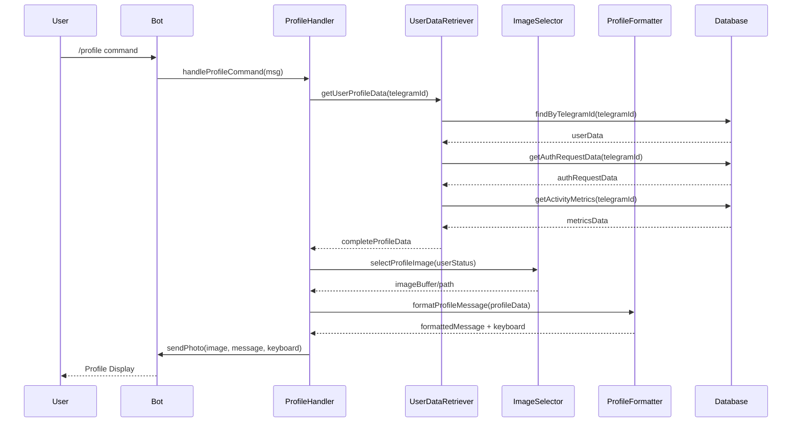
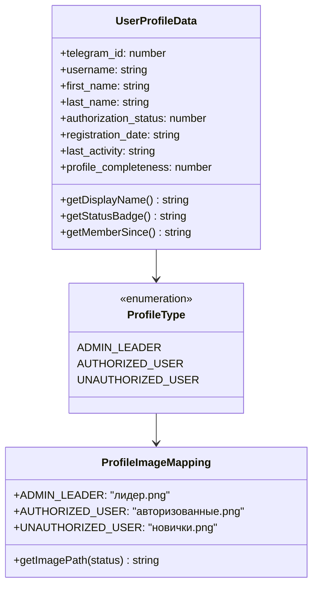
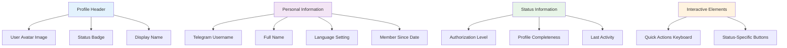
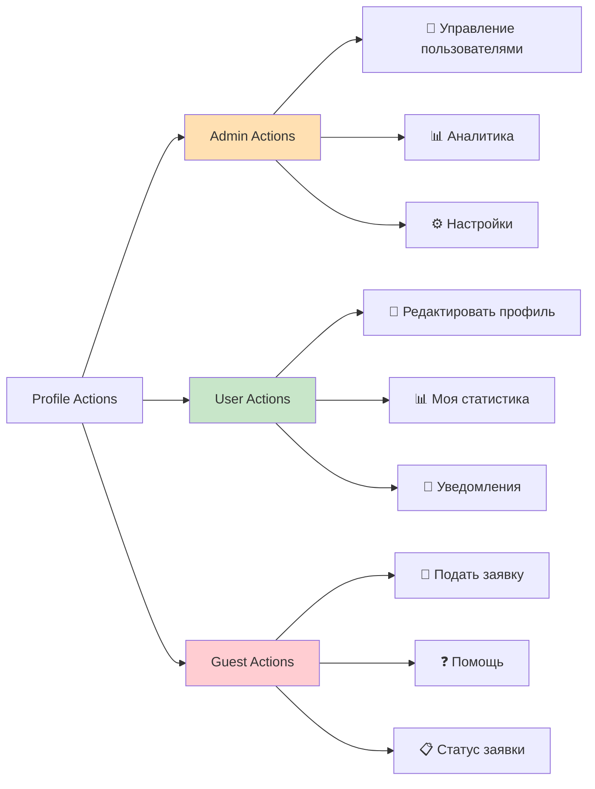
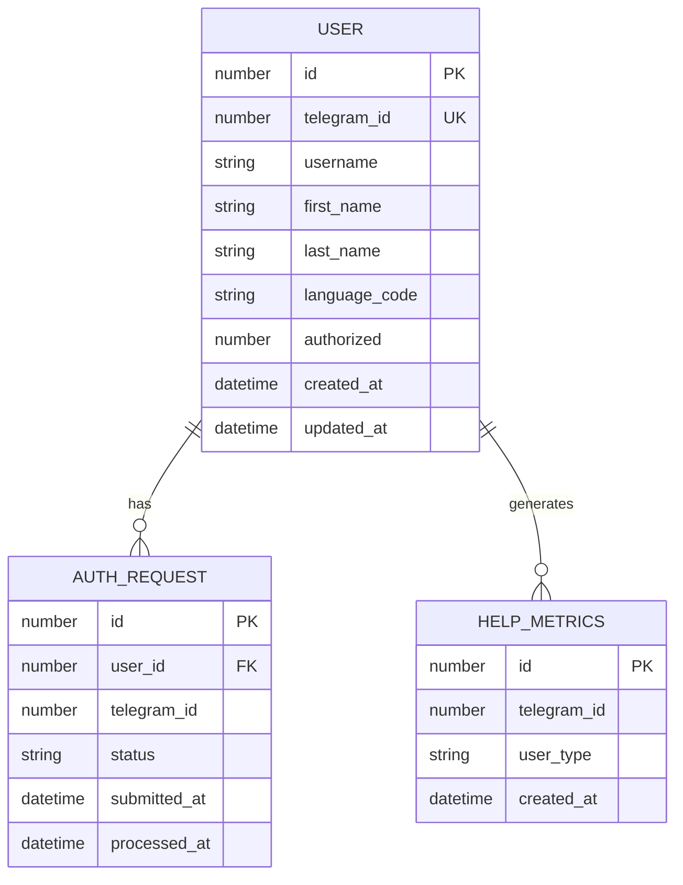
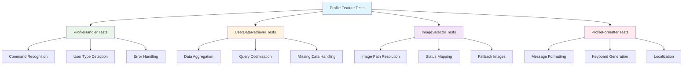

# User Profile Display Feature Design

## Overview
This design document outlines the implementation of a `/profile` command for the tgai Telegram bot that displays a visually appealing user profile with status-dependent imagery and comprehensive user information. The feature enhances user experience by providing personalized profile views based on authorization status.

## Technology Stack & Dependencies
- **Core Framework**: Node.js Telegram Bot application using `node-telegram-bot-api`
- **Database**: SQLite with existing User and TelegramModel tables
- **Image Processing**: Built-in file system operations for status-based image selection
- **UI Components**: Telegram inline keyboards and rich message formatting

## Architecture

### Component Structure
```mermaid
graph TB
    A[/profile Command] --> B[ProfileHandler]
    B --> C[UserDataRetriever]
    B --> D[ImageSelector]
    B --> E[ProfileFormatter]
    
    C --> F[User Model]
    C --> G[AuthRequest Model]
    C --> H[HelpMetrics Model]
    
    D --> I[Status Image Mapping]
    E --> J[Message Builder]
    E --> K[Inline Keyboard Builder]
    
    F --> L[SQLite Database]
    G --> L
    H --> L
    
    style A fill:#4CAF50
    style B fill:#2196F3
    style I fill:#FF9800
    style J fill:#9C27B0
```

### Profile Data Flow


## Feature Implementation

### Profile Status Categories
The system categorizes users into three distinct profile types:



### Profile Display Components

#### Status-Based Visual Elements
Each profile type displays distinct visual characteristics:

| Profile Type | Image | Status Badge | Color Theme | Special Elements |
|--------------|-------|--------------|-------------|------------------|
| Admin Leader | лидер.png | 👑 Лидер | Gold/Yellow | Crown emoji, special privileges list |
| Authorized User | авторизованные.png | ✅ Авторизован | Green | Verification checkmark, access level |
| Unauthorized User | новички.png | 🔒 Не авторизован | Orange/Red | Lock icon, authorization prompt |

#### Profile Information Layout


### Message Formatting Structure

#### Profile Message Template
```markdown
[STATUS_EMOJI] **[USER_DISPLAY_NAME]**
[STATUS_BADGE]

👤 **Личная информация**
├── Имя: [FIRST_NAME] [LAST_NAME]
├── Username: @[USERNAME]
├── Язык: [LANGUAGE_CODE]
└── Участник с: [REGISTRATION_DATE]

📊 **Статус профиля**
├── Уровень доступа: [AUTHORIZATION_LEVEL]
├── Заполненность профиля: [COMPLETENESS]%
└── Последняя активность: [LAST_ACTIVITY]

[STATUS_SPECIFIC_INFORMATION]
```

#### Status-Specific Information Sections

**Admin Leader Profile:**
```markdown
👑 **Административные привилегии**
├── Управление пользователями
├── Просмотр заявок на авторизацию
├── Доступ к аналитике
└── Системные настройки
```

**Authorized User Profile:**
```markdown
✅ **Права доступа**
├── Полный доступ к боту
├── Использование всех команд
└── Участие в активностях
```

**Unauthorized User Profile:**
```markdown
🔒 **Статус авторизации**
├── Ограниченный доступ
├── Подача заявки: [REQUEST_STATUS]
└── Необходима авторизация
```

### Interactive Profile Elements

#### Dynamic Keyboard Layout


## Database Integration

### Data Retrieval Strategy


### Profile Data Aggregation
The profile command aggregates data from multiple sources:

1. **User Table**: Basic profile information and authorization status
2. **AuthRequest Table**: Current authorization request status for unauthorized users
3. **HelpMetrics Table**: Activity data for last activity calculation
4. **TelegramModel Table**: Admin-specific information for leaders

## Error Handling & Edge Cases

### User State Validation
```mermaid
flowchart TD
    A[/profile Command] --> B{User Exists?}
    B -->|No| C[Create User Profile]
    B -->|Yes| D{Data Complete?}
    
    C --> E[Show Basic Profile]
    D -->|No| F[Fetch Missing Data]
    D -->|Yes| G[Display Full Profile]
    
    F --> H{Fetch Successful?}
    H -->|No| I[Show Partial Profile]
    H -->|Yes| G
    
    G --> J[Send Profile Image]
    E --> J
    I --> J
    
    J --> K{Image Send Success?}
    K -->|No| L[Send Text-Only Profile]
    K -->|Yes| M[Profile Displayed]
    
    style C fill:#FFF3E0
    style F fill:#FFF3E0
    style I fill:#FFEBEE
    style L fill:#FFEBEE
```

### Fallback Mechanisms
- **Image Loading Failure**: Display text-based profile with emoji indicators
- **Database Connection Issues**: Show cached profile information if available
- **Incomplete User Data**: Display available information with placeholders for missing fields
- **Permission Errors**: Graceful degradation with appropriate user feedback

## Testing Strategy

### Unit Testing Components


### Test Scenarios
1. **Admin Profile Display**: Verify crown image, admin privileges, and management tools
2. **Authorized User Profile**: Confirm green checkmark, full access indicators
3. **Unauthorized User Profile**: Test lock icon, authorization prompt, request status
4. **Edge Cases**: Missing usernames, incomplete registration, database errors
5. **Performance**: Response time under various load conditions
6. **Localization**: Profile display in different languages

## Implementation Considerations

### Performance Optimization
- **Image Caching**: Pre-load status images to reduce response time
- **Database Queries**: Single query to fetch all profile-related data
- **Message Formatting**: Template-based approach for consistent performance
- **Memory Management**: Efficient handling of user session data

### Security Measures
- **Data Sanitization**: Prevent injection attacks in profile display
- **Access Control**: Verify user permissions before displaying sensitive information
- **Privacy Protection**: Mask sensitive data for unauthorized viewers
- **Rate Limiting**: Prevent profile command abuse

### Scalability Features
- **Modular Design**: Easy addition of new profile sections and status types
- **Configuration-Driven**: Status mappings and templates in external configuration
- **Extensible Data Model**: Support for future profile enhancement features
- **Caching Strategy**: Implement profile data caching for high-frequency requests