# Vehicle Status Updater Feature Design

## Overview

The Vehicle Status Updater is a new feature designed to systematically update vehicle conditions in the garage database. This feature addresses the need to synchronize the database with current vehicle states based on maintenance records, inspection results, or external assessments.

### Business Context
The current garage management system maintains vehicle records with status values (Хорошее, Среднее, Плохое), but requires manual mechanisms to bulk update these statuses based on real-world conditions or maintenance outcomes.

### Core Requirements
- Update vehicle statuses based on provided vehicle-status mappings
- Handle discrepancies between database records and provided data
- Maintain data integrity and audit trails
- Support both individual and batch status updates
- Validate status transitions and business rules

## Architecture

### System Integration
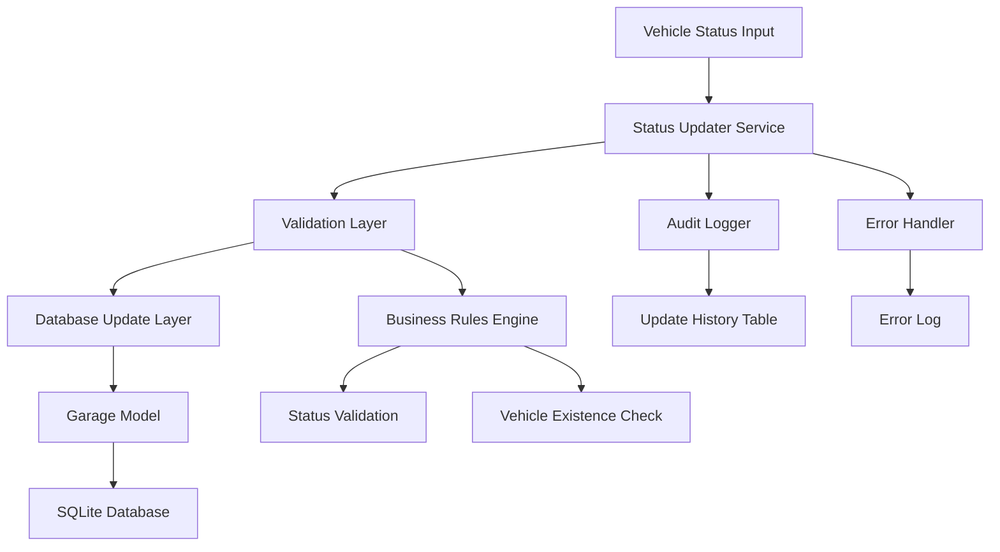

### Component Responsibilities

#### StatusUpdaterService
- Orchestrates the vehicle status update process
- Handles batch operations and transaction management
- Coordinates validation and database operations
- Manages error handling and rollback scenarios

#### ValidationLayer
- Validates vehicle names against database records
- Enforces business rules for status transitions
- Checks data format and consistency
- Handles fuzzy matching for vehicle name variations

#### DatabaseUpdateLayer
- Executes database update operations
- Manages transaction boundaries
- Implements atomic batch updates
- Handles database constraints and foreign key relationships

## Data Models & Status Management

### Current Database Schema
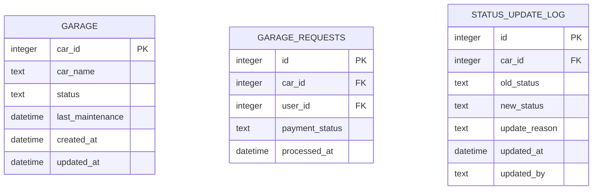

### Status Validation Rules
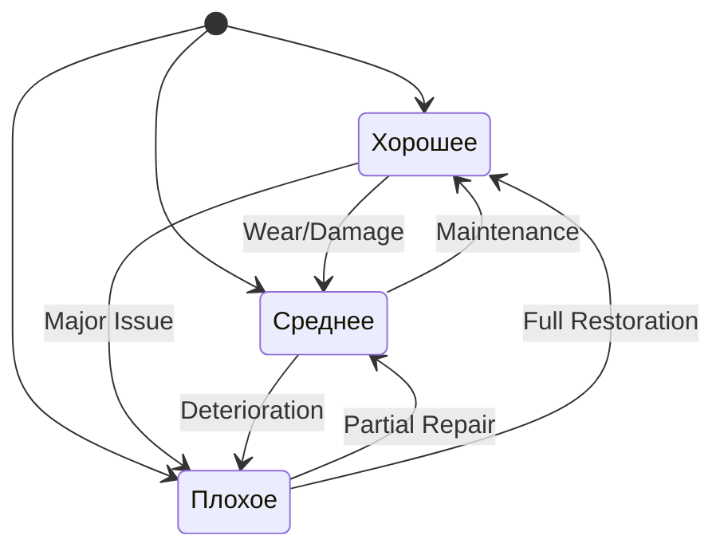

### Vehicle Mapping Strategy

#### Current Database Vehicles vs. Input Data
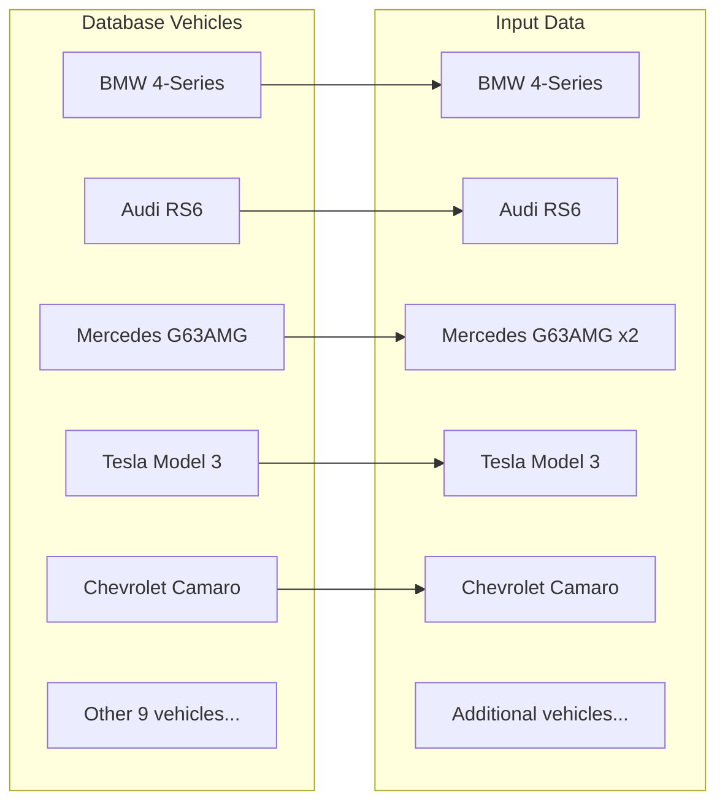

## API Design

### StatusUpdater Interface
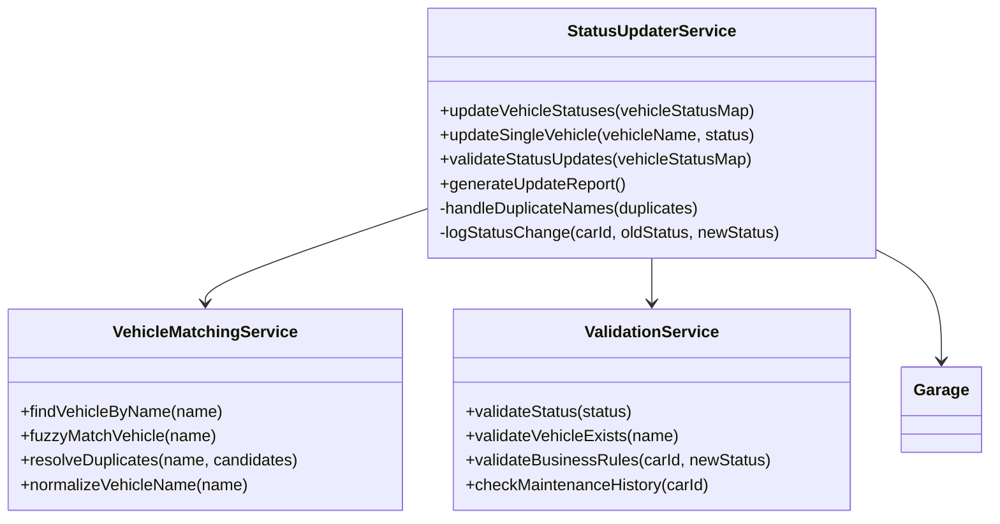

### Input Data Processing

#### Vehicle Status Input Format
| Vehicle Name | Current Status | Proposed Status |
|-------------|---------------|-----------------|
| BMW 4-Series | Среднее | хорошее |
| Audi RS6 | Плохое | хорошее |
| Mercedes G63AMG | Плохое | хорошее/среднее |

#### Status Normalization Rules
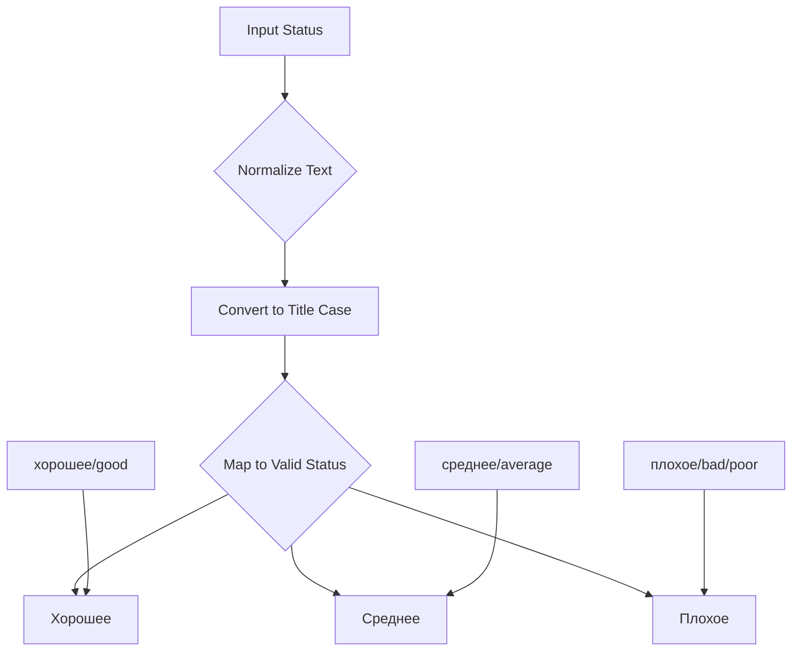

## Business Logic Layer

### Update Processing Workflow
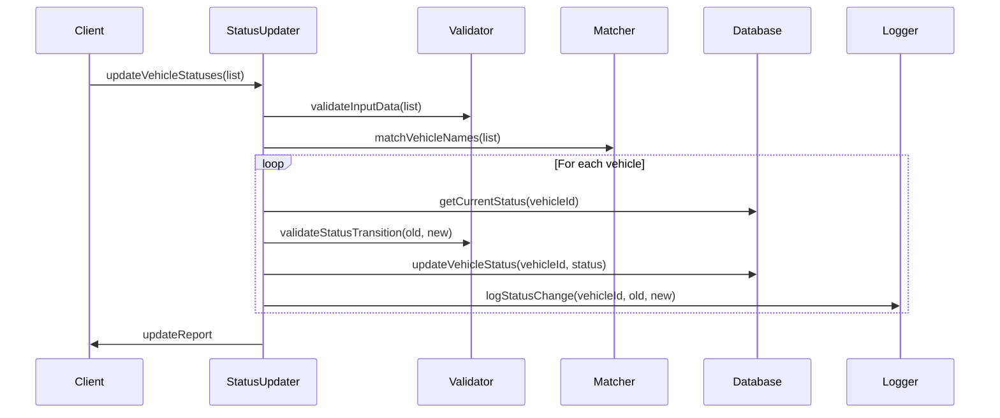

### Duplicate Handling Strategy
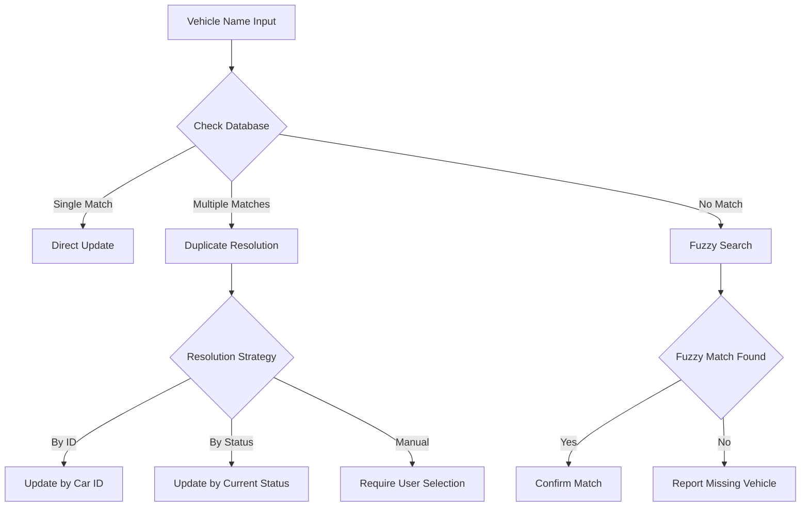

### Error Handling and Recovery

#### Error Classification
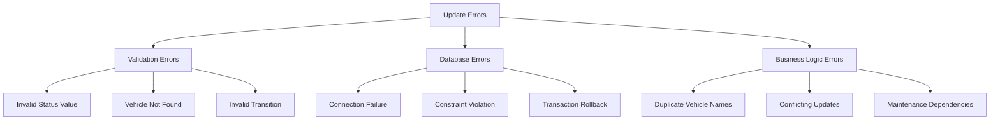

## Implementation Approach

### Phase 1: Core Status Update
- Implement basic status update functionality
- Handle exact vehicle name matches
- Support status validation and transition rules
- Create audit logging mechanism

### Phase 2: Advanced Matching
- Implement fuzzy name matching
- Handle duplicate vehicle name resolution
- Add batch processing capabilities
- Enhance error reporting

### Phase 3: Integration & UI
- Integrate with existing garage management system
- Add admin interface for bulk updates
- Implement approval workflow for sensitive changes
- Create reporting and analytics features

## Data Migration Strategy

### Handling Current Data Discrepancies

#### Analysis of Provided Vehicle List
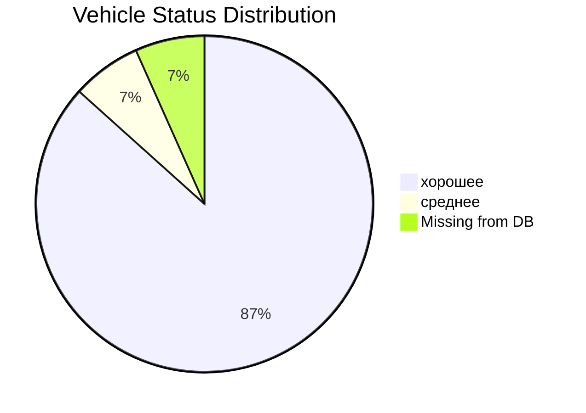

#### Migration Steps
1. **Data Analysis**: Compare input list with current database
2. **Vehicle Addition**: Add missing vehicles to database
3. **Status Mapping**: Map Russian status terms to database values
4. **Duplicate Resolution**: Handle Mercedes G63AMG duplicate entry
5. **Batch Update**: Execute validated status updates
6. **Verification**: Confirm all updates completed successfully

### Database Transaction Management
```mermaid
sequenceDiagram
    participant Service
    participant Database
    participant Rollback
    
    Service->>Database: BEGIN TRANSACTION
    
    loop For each vehicle update
        Service->>Database: UPDATE garage SET status = ?
        Database-->>Service: Success/Error
        
        alt Error occurs
            Service->>Rollback: ROLLBACK TRANSACTION
            Rollback-->>Service: Transaction cancelled
            break
        end
    end
    
    Service->>Database: COMMIT TRANSACTION
    Database-->>Service: All changes persisted
```

## Testing Strategy

### Unit Testing Requirements
- Status validation logic testing
- Vehicle matching algorithm testing
- Database update operation testing
- Error handling scenario testing

### Integration Testing Scenarios
- End-to-end update workflow testing
- Transaction rollback testing
- Concurrent update handling
- Database constraint validation

### Test Data Setup
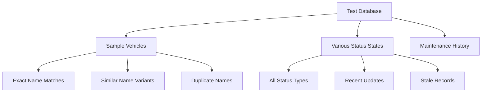

## Performance Considerations

### Batch Processing Optimization
- Implement database connection pooling
- Use prepared statements for bulk updates
- Optimize transaction batch sizes
- Monitor memory usage during large updates

### Scalability Measures
- Index optimization for vehicle name lookups
- Caching mechanism for frequent status checks
- Asynchronous processing for large batches
- Progress tracking for long-running operations

## Security and Audit

### Security Requirements
- Validate all input data to prevent SQL injection
- Implement access control for status update operations
- Log all administrative actions with user attribution
- Encrypt sensitive vehicle information if required

### Audit Trail Design
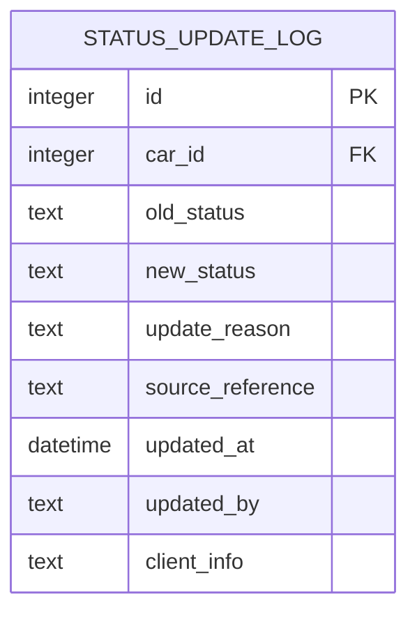

## Monitoring and Alerting

### Operational Metrics
- Update success/failure rates
- Processing time per vehicle
- Database transaction duration
- Error frequency by type

### Alert Conditions
- Failed batch updates
- Suspicious status change patterns
- Database connectivity issues
- Validation rule violations

This design provides a comprehensive framework for implementing the vehicle status updater while maintaining system integrity and providing robust error handling capabilities.